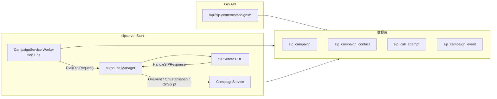
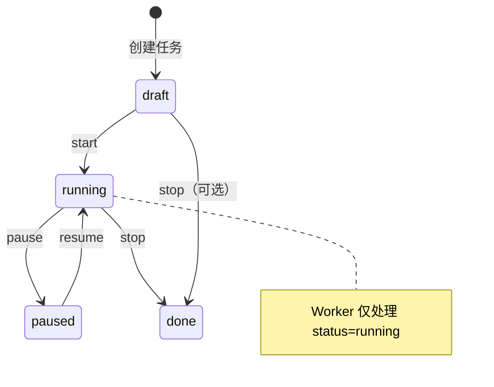
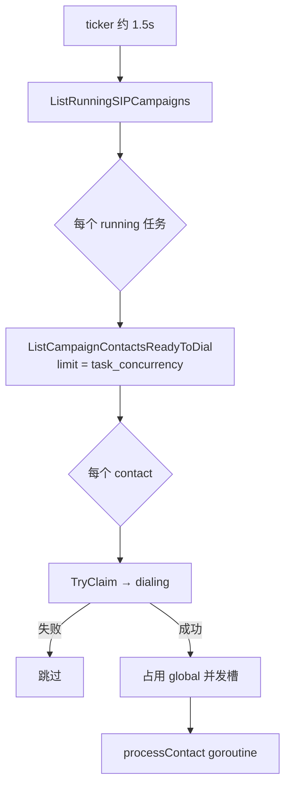
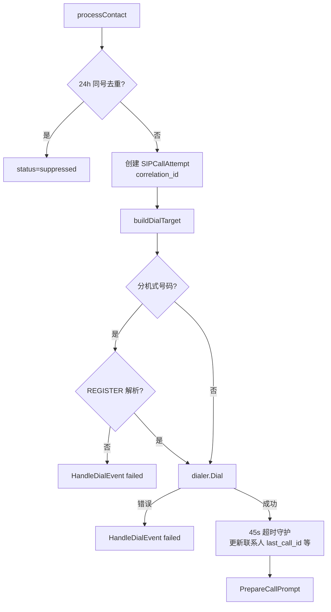
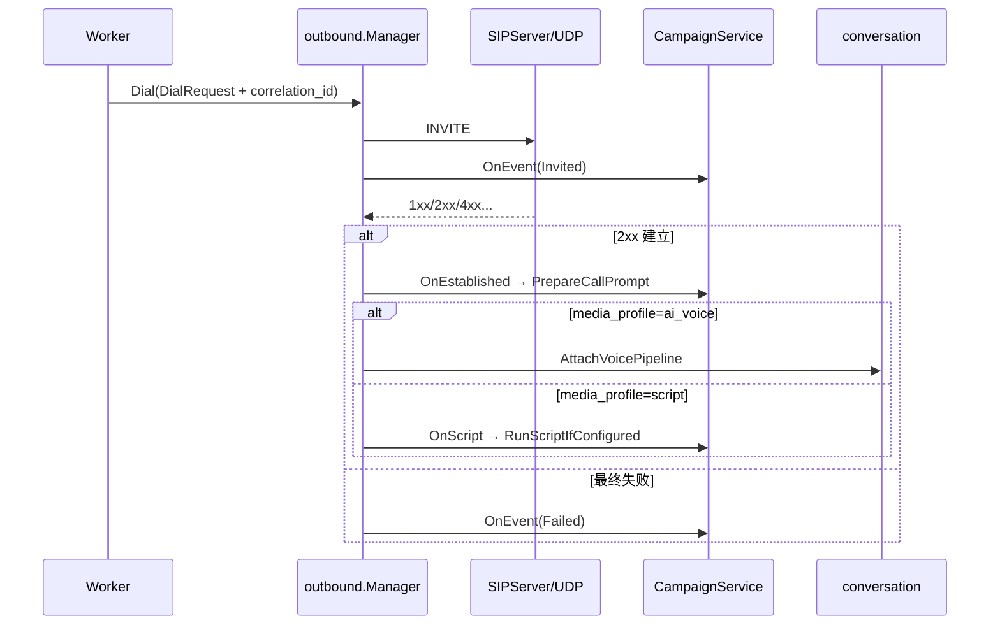

# 外呼任务（SIP Campaign）现行流程说明

本文描述当前仓库里**外呼任务**从配置、入库、轮询拨号到通话结束与重试的端到端流程，便于后续「大刀阔斧」改造时对齐现状。涉及的主要包：`internal/sipserver`（`CampaignService` + Worker）、`pkg/sip/outbound`（`Manager` / INVITE）、`internal/handler`（HTTP API）、`internal/models`（GORM 模型与查询）。

HTTP 路由挂在 **`{APIPrefix}/sip-center/...`** 下（默认 `API_PREFIX=/api`，即 `/api/sip-center/...`）。

---

## 1. 核心概念与数据模型

| 实体 | 作用 |
|------|------|
| **SIPCampaign** | 一次外呼「任务」：名称、状态（draft / running / paused / done）、场景 `scenario`、媒体模式 `media_profile`、外呼路由（`outbound_host` / `signaling_addr` / `request_uri_fmt` 等）、话术与脚本字段、`task_concurrency`（单任务并行上限）、`max_attempts` 等。 |
| **SIPCampaignContact** | 任务下的被叫一行：号码、可选 `request_uri`、主叫覆盖、优先级、`status`、`next_run_at`（到点才参与拨号）、`attempt_count` 等。 |
| **SIPCallAttempt** | 每一次实际拨号尝试：`attempt_no`、`correlation_id`、`state`、与 SIP 失败码等。 |
| **SIPCampaignEvent** | 面向控制台的流水日志（dispatch / dial / retry / script 等）。 |
| **SIPScriptRun** | `media_profile=script` 时脚本引擎逐步执行记录。 |

**Correlation ID**（贯穿 outbound → campaign → 话术/脚本）格式固定为：

`camp:<campaignID>:contact:<contactID>:attempt:<n>`

Outbound 在 `DialRequest.CorrelationID` 中携带；`CampaignService.HandleDialEvent`、`PrepareCallPrompt`、`RunScriptIfConfigured` 均通过 `parseCorrelation` 解析。

---

## 2. 运行时如何拼在一起

进程启动时（`internal/sipserver/sipapp.go` 的 `Start`）在**数据库可用**的前提下会：

1. 创建 **`outbound.Manager`**（发 INVITE、收响应、建 RTP、按 `MediaProfile` 挂媒体钩子）。
2. 创建 **`CampaignService`**，注入 **`DialTargetResolver`**（优先来自 `GormStore` 的 REGISTER 绑定）。
3. 调用 **`campaignSvc.StartWorker(outMgr)`**：外呼 Worker 与 Outbound 共用同一 `outMgr.Dial`。
4. 将 **`OnEvent` → `HandleDialEvent`**、**`OnEstablished` → `PrepareCallPrompt`**、**`OnScript` → `RunScriptIfConfigured`** 接到 Manager 配置。

因此：**外呼任务不是独立 HTTP 微服务**，而是与 SIP UDP、`conversation` 语音管线、可选脚本跑在同一进程内的协程 + 回调。

---

## 3. 运营侧流程（控制台 / API）

典型顺序：

1. **POST** `.../sip-center/campaigns` — 创建任务（默认 `draft`；Handler 里若未填 `scenario` 则 `campaign`，未填 `media_profile` 则 **`script`**）。
2. **POST** `.../sip-center/campaigns/:id/contacts` — 批量导入联系人（`ready`，`next_run_at` 一般为当前时间）。
3. **POST** `.../sip-center/campaigns/:id/start` — 状态改为 **`running`**，Worker 才会捞取该任务。
4. 运行中可 **pause / resume / stop**；**delete** 要求非 `running`。

---

## 4. Worker 轮询与并发

实现位置：`internal/sipserver/worker.go`。

- **周期**：默认每 **1500ms** `tick` 一次。
- **全局并发**：信号量 **`globalConcurrency`（默认 20）**，所有任务共享，防止同时起太多 goroutine。
- **单任务并发**：对每个 `running` 的 campaign，本 tick 最多取 **`task_concurrency`** 条联系人（默认 5，至少 1）。
- **取数条件**（`ListCampaignContactsReadyToDial`）：`status IN (ready, retrying)` 且 **`next_run_at` 为空或 ≤ 当前时间**；按 `priority desc, id asc`。
- **抢占**：`TryClaimSIPCampaignContactDialing` 将 `ready/retrying` **CAS 成 `dialing`**，避免多 tick 重复拨同一联系人。

---

## 5. 单联系人拨号：`processContact`

仍见 `internal/sipserver/worker.go` + `campaign_service.go`。

概要步骤：

1. **24h 去重**（`dedupeWindow`）：同一 `campaign_id` 下相同 `phone`、且 24h 内已有**其他**联系人拨过，则本联系人标 **`suppressed`**，不再外呼。
2. 生成 **`attemptNo = attempt_count + 1`** 与 **`correlation_id`**，写入 **`SIPCallAttempt`**（`state=dialing`），更新联系人 `attempt_count`、`last_dial_at`。
3. **`buildDialTarget`**（优先级）：
   - 联系人自带 **`request_uri`** → 必须配任务级 **`signaling_addr`**；
   - 否则任务级 **`request_uri_fmt`** + `phone`；
   - 否则 **`sip:{phone}@{outbound_host}:{outbound_port}`**，信令地址为 `signaling_addr` 或 `host:port`。
4. **分机 / 非纯数字号码**：`shouldResolveFromRegister` 为 true 时，**必须用 REGISTER 解析**（resolver 或 DB 在线用户）；解析失败则 **快速失败**（模拟 `DialEventFailed`，无静态回落）。
5. **`dialer.Dial(ctx, DialRequest)`** — 场景来自任务 `scenario`（默认 `campaign`），媒体来自 `media_profile`。
6. 若 `media_profile == script`，对 Call-ID **`MarkSIPScriptMode`**。
7. 启动 **`watchDialAttemptTimeout`（45s）**：若 attempt 仍为 `dialing`，则注入失败事件（408 / `timeout_no_final_response`）。
8. **`PrepareCallPrompt`**：若任务配置了 `system_prompt` / 开场白 / 结束语，写入 `conversation.SetSIPCallSystemPrompt`（供 AI 语音侧使用）。

---

## 6. Outbound：`Dial` 之后发生什么

实现：`pkg/sip/outbound/manager.go` 等。

- **`Dial`**：分配 RTP、组 SDP、发 **INVITE**，并 **`OnEvent(Invited)`**。
- 响应在 **`HandleSIPResponse`** 中交给对应 `outLeg`：早期响应 → **`Provisional`**；**2xx** → ACK、建 `CallSession`、按 **`MediaProfile`**：
  - **`ai_voice`**：`MediaAttach` → `conversation.AttachVoicePipeline`（与呼入类似的 ASR→LLM→TTS）。
  - **`script`**：回调 **`OnScript`** → `CampaignService.RunScriptIfConfigured`（混合脚本 + `SpeakTextOnce` / 轮询对话轮次等）；脚本正常结束会 **`RequestSIPHangup`**。
  - 其他 profile 见 `pkg/sip/outbound/types.go` 注释。
- 失败或超时 → **`OnEvent(Failed)`**。

---

## 7. `HandleDialEvent` 与联系人状态

`internal/sipserver/campaign_service.go` 的 `HandleDialEvent`：

| 事件 | 主要副作用 |
|------|------------|
| **Invited / Provisional** | 记 `SIPCampaignEvent`。 |
| **Established** | 更新 attempt 与联系人 **`answered`**、`last_call_id`。 |
| **Failed** | `markAttemptFailed`：根据 **`computeNextRetry(attemptNo)`** 与 **`MaxAttempts`** 将联系人置为 **`retrying`**（写 `next_run_at`）或 **`failed`/`exhausted`**。 |

**重试间隔**：当前实现为代码内固定 **`5m → 30m → 2h`**（按第 1、2、3 次失败对应）；表字段 **`retry_schedule`** 存在，但 **`computeNextRetry` 尚未解析该字符串**——改造时若要做可配置重试，这是明显挂钩点。

---

## 8. 与「环境变量自动外呼」的区别

`internal/sipserver/sipapp.go` 在解析到 **`SIP_TARGET_NUMBER` + 完整 outbound 目标**且 **`AutoDialFromEnv()`** 为真时，会 **单独 `go outMgr.Dial(..., ScenarioCampaign, MediaProfileAI)`**，**不经过** `SIPCampaign` 表与 Worker。文档上可与「任务外呼」区分，避免混淆。

---

## 9. 关键源文件索引

| 模块 | 路径 |
|------|------|
| SIP 启动与 Worker 挂载 | `internal/sipserver/sipapp.go` |
| 轮询与 `processContact` | `internal/sipserver/worker.go` |
| 事件、脚本、重试、话术注入 | `internal/sipserver/campaign_service.go` |
| HTTP 任务 CRUD / 联系人 / 状态 | `internal/handler/sip_campaigns.go`、`internal/handler/sip_contact_center.go` |
| 模型与 SQL 条件 | `internal/models/sip_campaign.go` |
| INVITE 与媒体分支 | `pkg/sip/outbound/manager.go`、`pkg/sip/outbound/types.go` |

---

## 10. 改造时可优先关注的「接缝」

1. **Worker 模型**：定时全表扫 `running` + 每任务 `limit`，无独立队列中间件；扩缩、公平性、延迟调度可在此动刀。  
2. **重试策略**：`retry_schedule` 与 `computeNextRetry` 不一致。  
3. **Handler 与 Service 默认值**：HTTP 创建默认 `media_profile=script`，`CampaignService.CreateCampaign` 默认 `ai_voice`——若存在双入口需统一。  
4. **观测**：`SIPCampaignEvent` + `getSIPCampaignLogs` 聚合 attempts / script steps；指标有 DB 聚合与 `SnapshotMetrics()` 进程内计数两套。  
5. **分机外呼**：与 REGISTER / `GormStore` 强绑定，改拨号策略时需保留或替换 resolver 语义。

---

*文档版本：与仓库当前代码一致；若你后续改流程，请同步更新本节与 Mermaid 图。*
