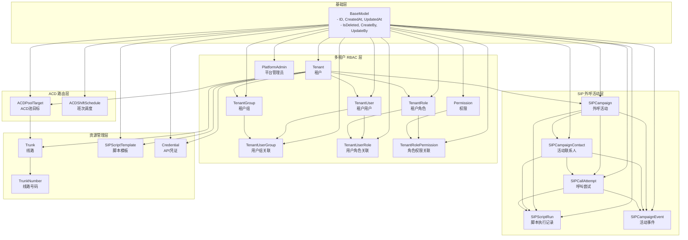
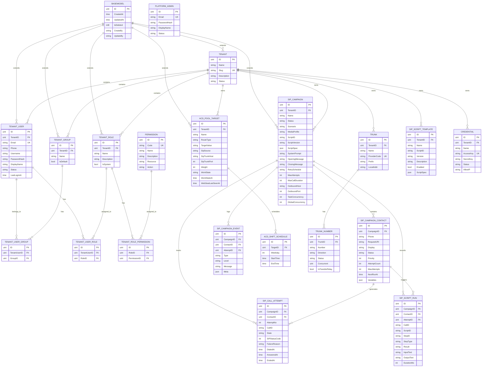
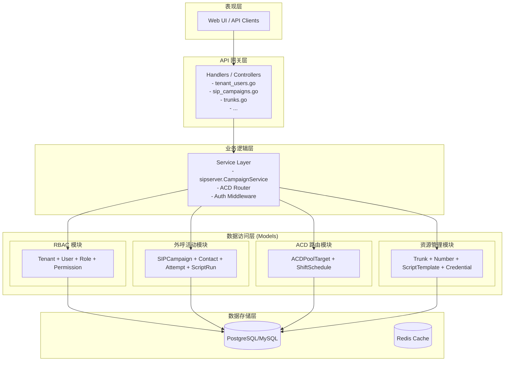
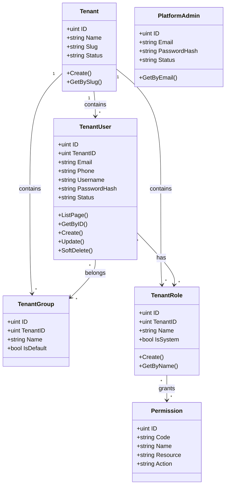
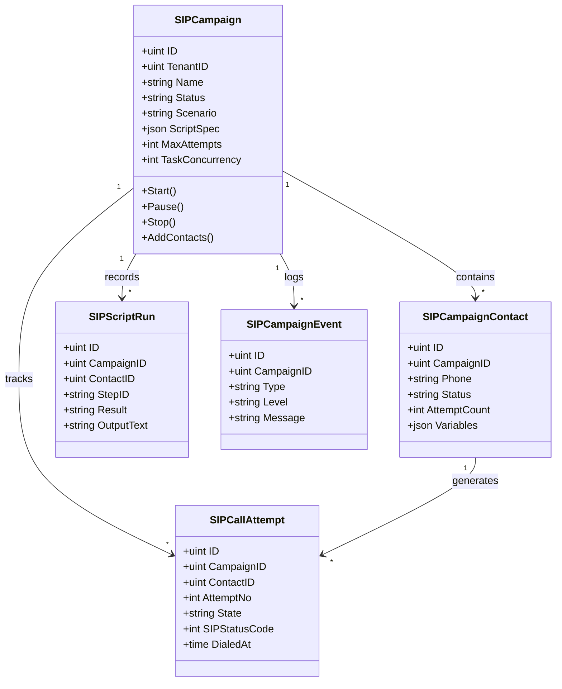
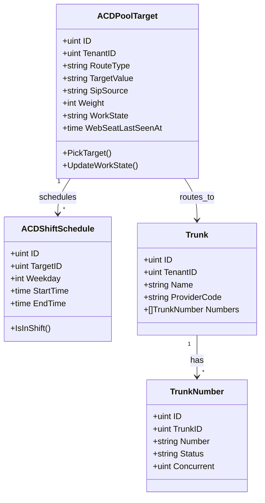
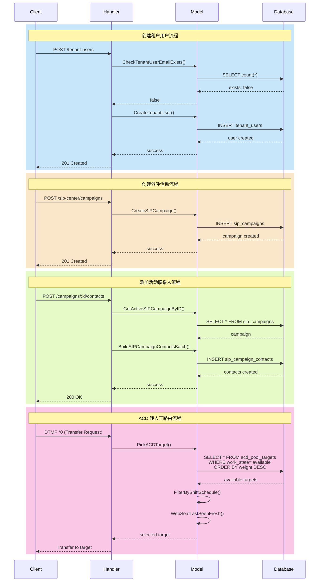

# LingEchoX 模型架构图

## 整体架构概览

## ER 实体关系图

## 模块分层架构

## 核心领域模型关系

### 1. 多租户 RBAC 领域

### 2. SIP 外呼活动领域

### 3. ACD 路由领域

## 数据流向图

## 表结构汇总

| 模块 | 表名 | 说明 |
|------|------|------|
| 基础 | base_model | 所有模型的基类字段 |
| RBAC | tenants | 租户表 |
| RBAC | tenant_users | 租户用户表 |
| RBAC | tenant_groups | 租户组表 |
| RBAC | tenant_user_groups | 用户-组关联表 |
| RBAC | tenant_roles | 租户角色表 |
| RBAC | tenant_user_roles | 用户-角色关联表 |
| RBAC | permissions | 权限表 |
| RBAC | tenant_role_permissions | 角色-权限关联表 |
| RBAC | platform_admins | 平台管理员表 |
| 外呼 | sip_campaigns | 外呼活动表 |
| 外呼 | sip_campaign_contacts | 活动联系人表 |
| 外呼 | sip_call_attempts | 呼叫尝试记录表 |
| 外呼 | sip_script_runs | 脚本执行记录表 |
| 外呼 | sip_campaign_events | 活动事件日志表 |
| ACD | acd_pool_targets | ACD池目标表 |
| ACD | acd_shift_schedules | 班次调度表 |
| 资源 | sip_trunks | 线路表 |
| 资源 | sip_trunk_numbers | 线路号码表 |
| 资源 | sip_script_templates | 脚本模板表 |
| 资源 | credentials | API凭证表 |
