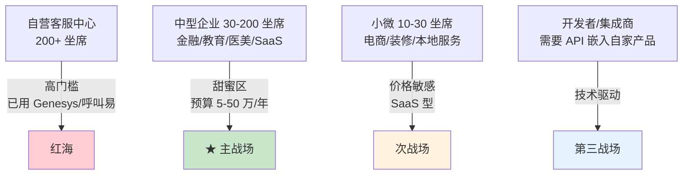
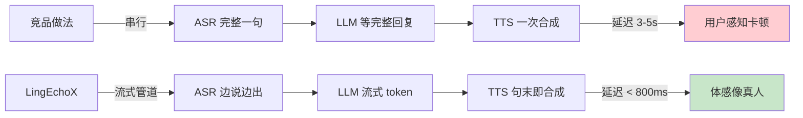
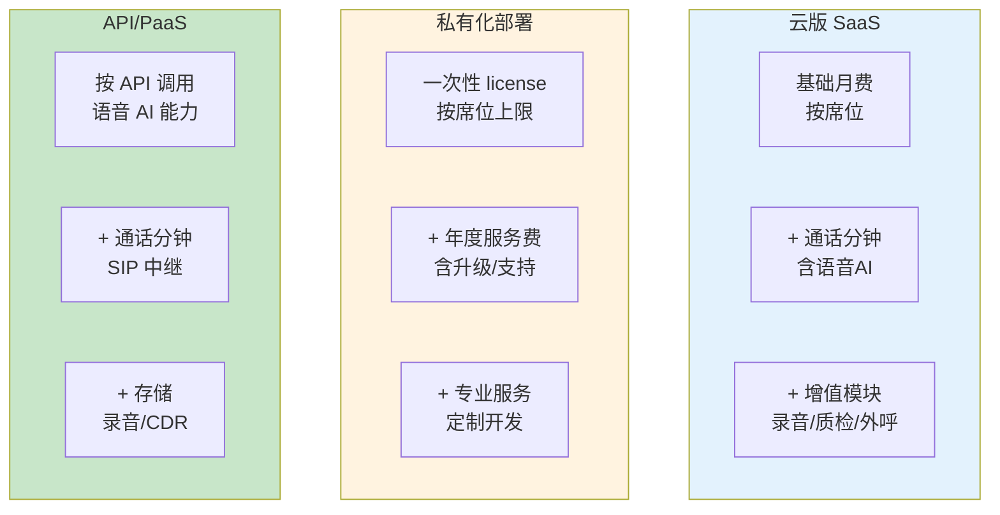
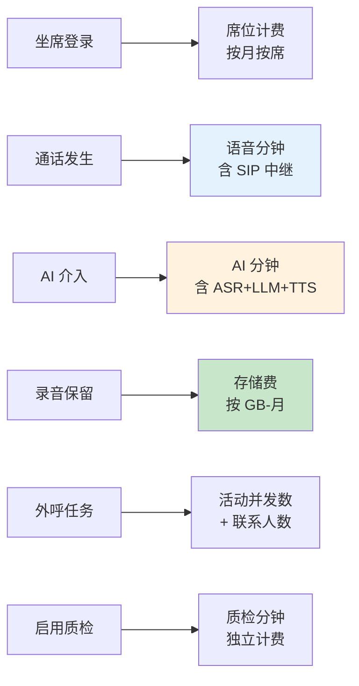
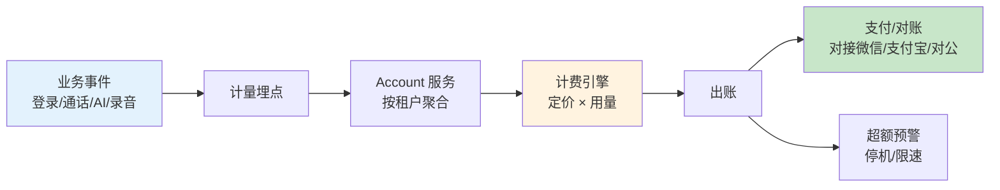
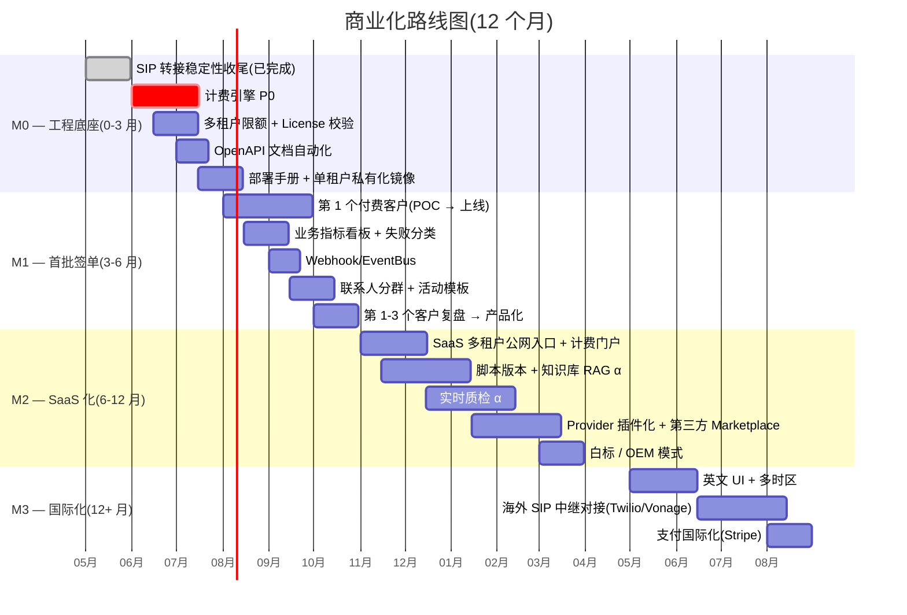
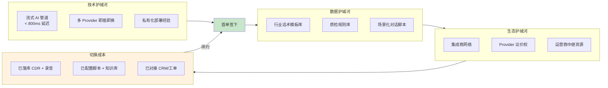

# LingEchoX 商业化与产品策略

> 本文档面向 **创始人 / 产品 / 销售 / 投资人**,从市场切入、产品差异化、计费
> 模型、需要补齐的功能、商业护城河五个角度,把 LingEchoX 从"技术可用"推到
> "可售卖"。
>
> 与现有文档分工:
>
> - `docs/project-overview.md` — 产品现状(已实现什么)
> - `docs/roadmap.md` — 业务功能路线图(M1-M4 时间窗)
> - `docs/future-development.md` — 综合现状 + 待修边界 + 大方向
> - **本文档** — 商业化路径、计费、卖点、签单需要的能力清单

---

## 1. 市场切入与目标客户

### 1.1 市场分层



### 1.2 推荐切入顺序

| 阶段 | 客户类型 | 卖什么 | 目标 ARR |
|------|---------|--------|---------|
| **0-6 月** | 中型企业自建呼叫中心 | 私有化部署 + 一次性买断 + 年度服务费 | 300-500 万 |
| **6-18 月** | 中小企业 SaaS | 多租户云版,按席位 + 通话分钟 | 800-1500 万 |
| **18+ 月** | 集成商 / ISV | API 接入,按 API 调用 + 通话分钟 | 1500+ 万 |

### 1.3 三类典型客户画像

#### 客户 A:中型金融/教育(自建优先)

- **痛点**:Genesys/呼叫易/讯鸟成本高(年费 60 万起),不支持 AI
- **预算**:30-100 万/年
- **决策链**:CTO + 业务负责人,3-6 月 POC
- **卖点**:私有化 + 数据不出企业 + AI 内置
- **典型规模**:50-200 坐席,日均 5000-20000 通

#### 客户 B:医美/装修/SaaS(SaaS 优先)

- **痛点**:用人工外呼成本高,转化率低,人难招
- **预算**:1-10 万/月
- **决策链**:营销总监 + 老板,1-2 月决定
- **卖点**:开箱即用 + AI 替代 70% 人工 + 按效果付费
- **典型规模**:10-50 坐席,日均 1000-10000 通

#### 客户 C:其他 SaaS / 内部系统集成

- **痛点**:自己做语音 AI 太贵,买不起 Twilio + OpenAI 拼凑
- **预算**:按用量
- **决策链**:技术负责人,1-2 周 POC
- **卖点**:一站式语音中台 + Provider 多选 + 文档完整
- **典型规模**:开发者 + 自研产品

---

## 2. 核心卖点(差异化)

### 2.1 产品差异化矩阵

| 维度 | LingEchoX | 阿里云联络中心 | Genesys | Twilio + OpenAI | 自研 |
|------|-----------|--------------|---------|----------------|------|
| **AI 通话能力** | ✅ 原生(ASR+LLM+TTS) | ⚠ 需对接 | ⚠ 插件 | ✅ 但贵 | ❌ 难做 |
| **私有化部署** | ✅ | ❌ | ✅ 但贵 | ❌ | ✅ |
| **多 Provider 切换** | ✅ 8+ ASR/TTS/LLM | ⚠ 锁定 | ⚠ 锁定 | ⚠ 部分 | ❌ |
| **国内运营商对接** | ✅ 中继 + ANI 透传 | ✅ | ❌ | ❌ | ✅ 难 |
| **国产化合规** | ✅ 信创可适配 | ✅ | ❌ | ❌ | 取决于 |
| **WebRTC 坐席** | ✅ | ✅ | ✅ | ⚠ 自己拼 | ❌ 难 |
| **录音质量** | ✅ 立体声+流式分片 | ✅ | ✅ | ⚠ | ❌ |
| **价格** | 中 | 中-高 | 高 | 高 | 极高 |
| **可二次开发** | ✅ 源码交付 | ❌ | ⚠ | ❌ | ✅ |

### 2.2 三大核心卖点(销售话术)

#### 卖点 #1:**"AI Native,不是把 LLM 拼上呼叫中心"**



- **首字延迟 < 800ms**:VAD + ASR partial result + LLM streaming + TTS segmenter 全链路流式
- **可被打断(barge-in)**:用户开口 200ms 内 AI 闭嘴
- **录音质量**:立体声 WAV,左右声道分离用户/AI,质检和回放都能用

#### 卖点 #2:**"私有化 + 国产化 + 合规可审计"**

- **数据不出企业**:模型可走私有化(本地 LLM)或在企业 VPC 内调云
- **信创适配路径清晰**:基于 Go,可编译到银河麒麟 / 统信 UOS / 飞腾架构
- **录音 sha256 上链就绪**:每段录音都有哈希,可作司法证据
- **CDR 完整**:呼叫详单 + 录音哈希 + 转接 ACD 目标全落库,符合金融监管

#### 卖点 #3:**"开放,不锁死"**

- **8+ ASR/TTS/LLM Provider 可切换**:Deepgram / Google / QCloud / Qiniu / Baidu / 火山 / 讯飞 / Azure 等
- **源码交付选项**:大客户可买断,自己迭代不依赖原厂
- **API-first**:每个能力都能单独调,不强迫用整套
- **多租户隔离做到底层**:不是中间件层逻辑分,是 DB schema 层强隔离

---

## 3. 计费模型设计

### 3.1 三种模式并存



### 3.2 SaaS 计费(详细)

#### 基础版 / 标准版 / 企业版

| 项目 | 基础版 | 标准版 | 企业版 |
|------|-------|--------|-------|
| **席位月费(/席)** | ¥199 | ¥399 | ¥799 |
| **包含通话分钟** | 500 min | 1500 min | 3000 min |
| **超出分钟** | ¥0.20/min | ¥0.15/min | ¥0.10/min |
| **AI 通话(ASR+LLM+TTS)** | ¥0.30/min | ¥0.25/min | ¥0.20/min |
| **录音存储** | 30 天 | 90 天 | 1 年 |
| **WebRTC 坐席** | ✅ | ✅ | ✅ |
| **外呼活动** | 单活动 100 联系人/天 | 1000/天 | 不限 |
| **质检/报表** | ❌ | ✅ 基础 | ✅ 完整 |
| **API 接入** | ❌ | ✅ 限速 | ✅ |
| **私有 LLM** | ❌ | ❌ | ✅ |
| **SLA** | 99% | 99.5% | 99.9% + 工单 |

#### 计费维度详解



### 3.3 私有化定价

| 部署规模 | 一次性 License | 年度服务费 | 适用客户 |
|---------|--------------|-----------|---------|
| 小型(≤30 席) | ¥30 万 | ¥6 万/年 | 中小企业自建 |
| 中型(30-100 席) | ¥80 万 | ¥15 万/年 | 中型企业核心系统 |
| 大型(100-500 席) | ¥200 万 | ¥35 万/年 | 大企业全国部署 |
| 超大(>500 席) | 议价 | 议价 | 集团/运营商级 |

**包含**:
- 全功能授权(无模块限制)
- 1 年源码 escrow(可选)
- 安装部署 + 培训 + 上线支持
- 7×24 工单(企业版)

**不含**:
- 客户自有的 SIP 中继费用
- 第三方 ASR/TTS/LLM Provider 费用
- 服务器硬件 / IDC 费用

### 3.4 API/PaaS 定价(给开发者)

```yaml
ASR 流式:    ¥0.05 / 分钟   # 中文 / 英文
TTS 合成:    ¥0.08 / 万字符
LLM 调用:    透传 Provider 价格 + 15% 通道费
SIP 通话:    ¥0.10 / 分钟  # 主叫/被叫均收
录音存储:    ¥0.20 / GB-月
WebRTC 通道: ¥0.05 / 分钟  # 浏览器坐席侧

# 大客户阶梯返利
> 100 万分钟/月: 9 折
> 500 万分钟/月: 8 折,且 SLA 升级
```

### 3.5 计费引擎需要的能力(代码侧)



**需要新建的模块**(详见 §5):

- `pkg/billing/` — 计费引擎核心
- `pkg/billing/meter/` — 通话/AI/存储用量埋点
- `pkg/billing/pricing/` — 价格计算与套餐
- `pkg/billing/invoice/` — 出账与发票
- `internal/handlers/billing/` — 后台账单 / 充值 API
- `web/src/pages/Billing/` — 前端账单 / 套餐 / 充值

---

## 4. 商业化必备能力清单(签单门槛)

### 4.1 优先级矩阵

```mermaid
quadrantChart
    title 商业化能力优先级
    x-axis 实现成本(从低到高) --> 高
    y-axis 商业价值(从低到高) --> 高
    quadrant-1 立刻做
    quadrant-2 中期做
    quadrant-3 不做或外包
    quadrant-4 战略储备
    "计费引擎": [0.4, 0.95]
    "用量看板": [0.3, 0.85]
    "API 文档自动化": [0.2, 0.7]
    "多租户限额": [0.3, 0.8]
    "实时质检 alpha": [0.7, 0.85]
    "知识库增强对话": [0.6, 0.75]
    "Provider 插件化": [0.5, 0.7]
    "Webhook/EventBus": [0.4, 0.65]
    "私有 LLM 部署包": [0.7, 0.6]
    "信创适配验证": [0.5, 0.55]
    "白标 / OEM 模式": [0.6, 0.5]
    "国际版(英文 UI)": [0.4, 0.4]
```

### 4.2 P0(签第一单必须有)

| 能力 | 当前状态 | 缺口 |
|------|---------|------|
| **计费引擎** | ❌ | 全新建,见 §3.5 |
| **用量看板** | ⚠️ 有部分指标 | 通话分钟/AI 分钟/存储/坐席聚合视图 |
| **多租户限额** | ⚠️ 多租户 schema 在 | 月/日额度 + 超限停机 + 预警 |
| **License 校验** | ❌ | 私有化版本必备(席位上限 / 过期检测) |
| **API key 管理 + 限速** | ⚠️ AccessKeys 表存在 | 配额、限速、按 key 计费 |
| **审计日志** | ⚠️ 部分 | 关键操作留痕、可导出、不可篡改 |
| **数据导出** | ❌ | CDR / 录音 / 联系人批量导出(合规要求) |

### 4.3 P1(签 10 单内必须有)

| 能力 | 当前状态 | 缺口 |
|------|---------|------|
| **业务指标看板** | ❌ | 接通率/通话时长/AI 介入率/转化漏斗 |
| **失败原因分布** | ❌ | SIP code / 用户挂断时点 / AI 异常分类 |
| **统一 API 文档** | ❌ | OpenAPI/Swagger 自动生成 |
| **Webhook/EventBus** | ❌ | 通话事件推送(开始/接通/挂断/转人工) |
| **脚本版本管理** | ⚠️ 模板有 | 版本号 + 发布回滚 + diff |
| **联系人分群标签** | ❌ | 标签、来源、最近联络状态筛选 |
| **外呼活动模板** | ❌ | 沉淀并发/重试/时间窗模板 |
| **租户级 Provider 配置** | ⚠️ TenantAiConfig 在 | 默认/客户自带 key 双模 |

### 4.4 P2(签 50 单内补齐)

- **实时质检** — ASR + LLM 检测话术合规、情绪、关键意图
- **智能重呼策略引擎** — 基于历史接通时间 / 意向评分动态调度
- **知识库增强对话** — RAG 接入,问答增强语音代理
- **Provider 插件化** — 新 ASR/TTS/LLM 按插件注册,零侵入扩展
- **白标 / OEM** — 大客户冠名定制,移除 LingEchoX 品牌
- **国际版** — 英文 UI、多时区、多币种计费

### 4.5 P3(战略储备)

- **私有 LLM 部署包** — Llama/Qwen/DeepSeek 一键部署 + 微调链路
- **信创平台适配** — 银河麒麟 + 统信 UOS + 飞腾/鲲鹏架构
- **多渠道融合** — 微信/邮件/短信统一会话视图
- **AI Agent SDK** — 把 AI 通话能力包装为 SDK 卖给开发者

---

## 5. 工程上要新建的模块(从仓库视角)

```
LingEchoX/
├── pkg/
│   ├── billing/                  ← 新建,计费引擎
│   │   ├── meter/                  通话/AI/存储用量埋点
│   │   ├── pricing/                价格计算 + 套餐定义
│   │   ├── invoice/                出账 + 发票
│   │   └── quota/                  租户级限额 + 超额停机
│   │
│   ├── license/                  ← 新建,私有化 license 校验
│   │   ├── verify.go               席位上限/过期检测
│   │   └── activation.go           激活流程
│   │
│   ├── eventbus/                 ← 新建,Webhook/事件分发
│   │   ├── dispatcher.go           异步推送 + 重试
│   │   └── signing.go              HMAC 签名(防伪造)
│   │
│   └── analytics/                ← 新建,业务指标
│       ├── kpi.go                  接通率/转化率聚合
│       └── funnel.go               外呼漏斗
│
├── internal/handlers/
│   ├── billing/                  ← 新建,账单 API
│   ├── kpi/                      ← 新建,看板 API
│   └── webhook/                  ← 新建,Webhook 配置 API
│
├── web/src/pages/
│   ├── Billing/                  ← 新建,租户账单 / 套餐 / 充值
│   ├── KPI/                      ← 新建,业务看板
│   └── Webhook/                  ← 新建,Webhook 配置
│
└── docs/
    ├── api/                      ← 新建,OpenAPI 文档自动生成
    ├── deployment/               ← 新建,私有化部署手册
    └── security/                 ← 新建,合规 / 审计 / 数据出境
```

---

## 6. 商业化里程碑(执行甘特图)



---

## 7. 商业护城河(为什么客户跑不掉)



### 7.1 12 个月内能做到的 3 道护城河

1. **流式 AI 体验**(技术) — 已经有,继续打磨延迟到 < 500ms
2. **行业话术模板库**(数据) — 配合首批客户落地,沉淀 5-10 个垂类的脚本 + 质检规则
3. **运营商中继议价 + 集成商分销**(生态) — 与 1-2 家三四线运营商签战略合作,集成商 30% 分润

---

## 8. 风险与对冲

| 风险 | 影响 | 对冲 |
|------|------|------|
| **大厂(阿里/腾讯)推 AI 联络中心** | 价格战 | 私有化 + 国产化 + 行业垂类深耕 |
| **LLM Provider 涨价 / 断供** | 成本失控 | 多 Provider + 私有部署预案 |
| **数据合规收紧(《个人信息保护法》)** | 合规成本 | 录音哈希 + 审计日志先行 |
| **运营商外呼号管控** | 业务受限 | 主动合规、客户白名单、双向同意流程 |
| **竞品开源同类产品** | 价值被稀释 | 垂类深度 + 服务能力 + 集成商生态 |

---

## 9. 销售工具包清单(需要市场/销售配合产出)

- [ ] 30 秒电梯演讲(技术 / 业务两版)
- [ ] 5 分钟产品 demo 视频
- [ ] 行业方案白皮书(金融 / 教育 / 医美 / 装修各一)
- [ ] 客户案例 case study(首批 3 家成单后产出)
- [ ] ROI 计算器(替代人工的成本对比)
- [ ] 竞品对比表(vs 阿里 / 讯鸟 / Genesys / Twilio)
- [ ] POC 标准化 SOP(2 周从 demo 到上线)
- [ ] 合同 / SLA 模板(私有化 / SaaS 各一份)

---

## 10. 立即行动(本月 / 下月)

### 本月(2026-05)
- [x] 修完 SIP 转接 6 个边界(已完成,本次 commit)
- [ ] 立项计费引擎(`pkg/billing/`),起草数据模型
- [ ] 拟定 3 档 SaaS 套餐定价 + 内部审议
- [ ] 准备 demo 视频脚本

### 下月(2026-06)
- [ ] 计费引擎 P0 上线
- [ ] 部署手册 + 私有化镜像
- [ ] 第 1 家潜在客户 POC 启动
- [ ] OpenAPI 文档自动化

---

> 本文档应每月更新一次:更新签单数、ARR、客户反馈、护城河进展。
> 如果 6 个月内没有签下首单,需要重新审视市场切入(可能要从 SaaS 转 API,
> 或从国内转海外)。
