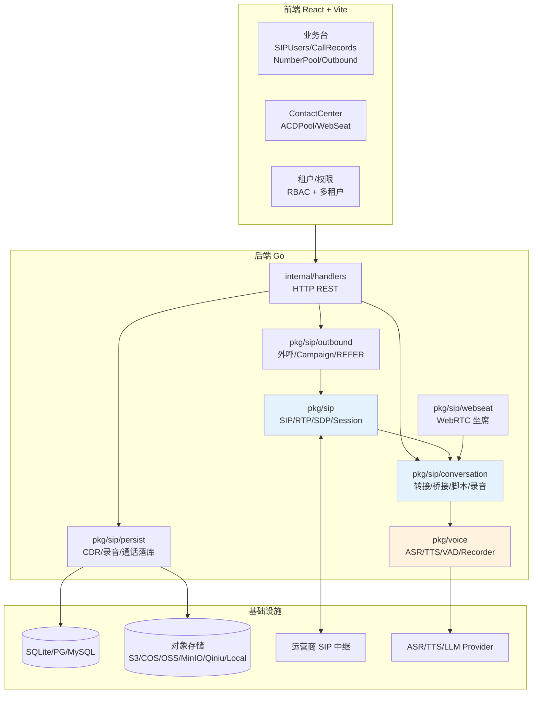
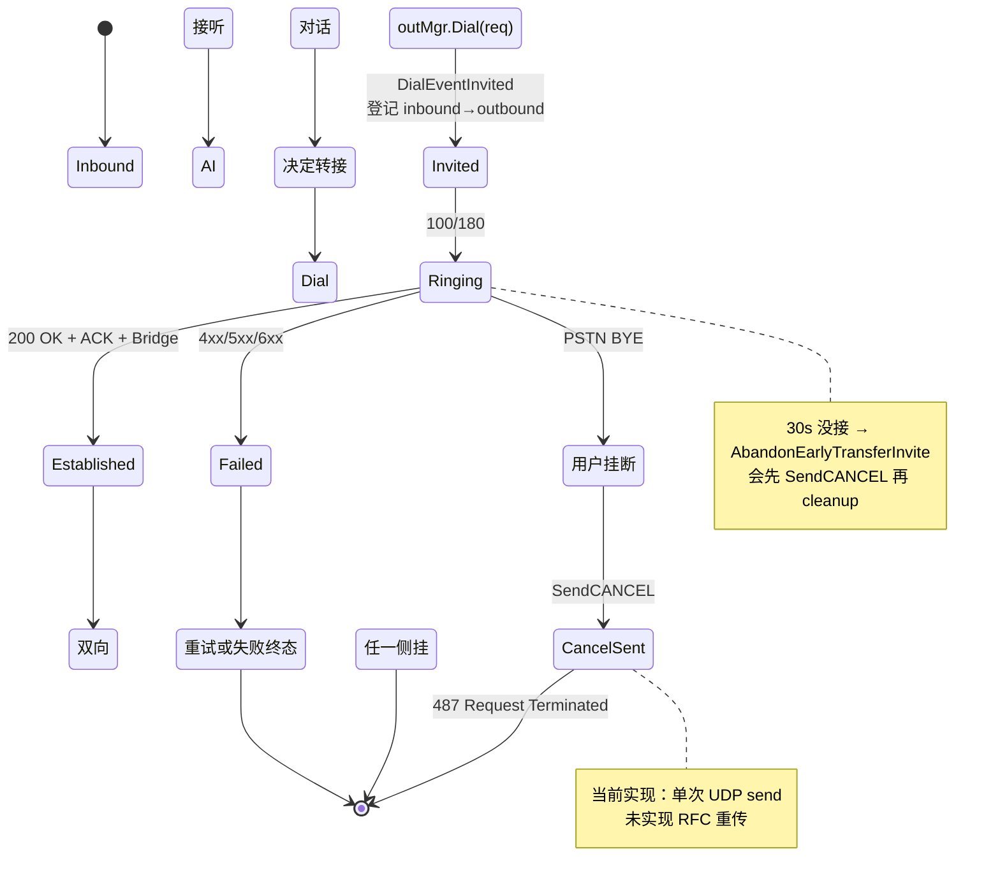
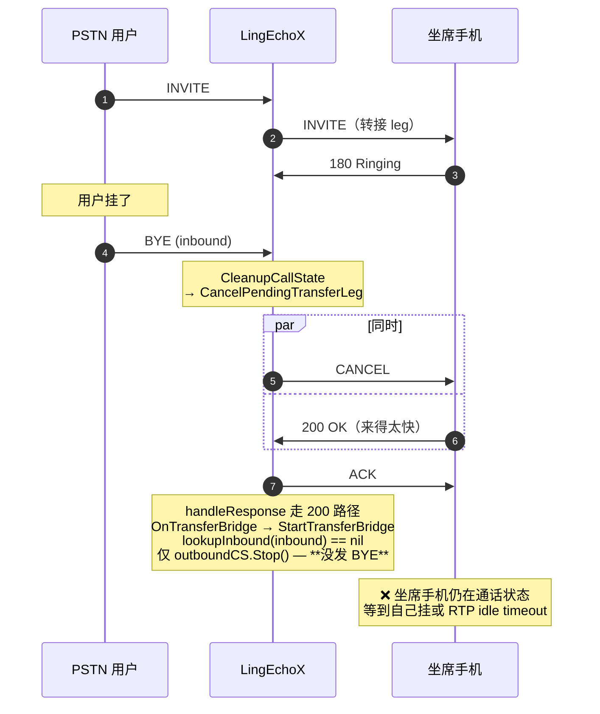
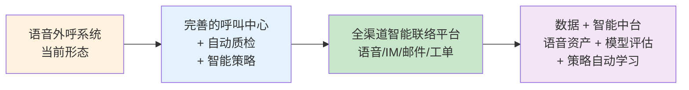
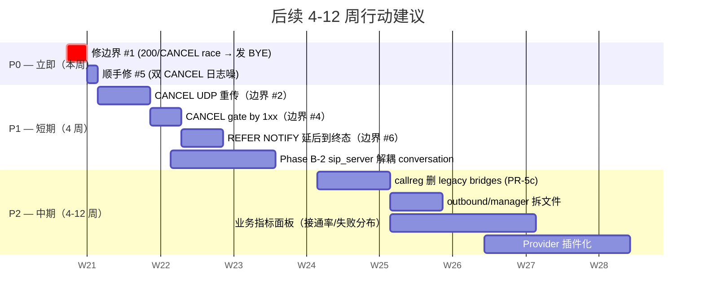

# LingEchoX 后续发展与待完善边界

> 本文档汇总 LingEchoX 项目**当前已交付能力**，**SIP / 转接 / 媒体层尚未处理
> 的边界情况**，以及**中长期发展方向**。与现有文档的分工：
>
> - `docs/project-overview.md` — 一句话概览 + 已有能力清单（产品视角）
> - `docs/roadmap.md` — 业务功能 roadmap（M1 / M2 / M3 / M4）
> - `docs/refactor-history.md` — 底层 / 协议栈对齐的工程历史
> - `docs/refactor-rfc.md` + `docs/refactor-progress.md` — 业务流程层重构 RFC 与 PR 进度
> - `docs/architecture-model.md` / `docs/design-critique.md` — 架构与设计批判
> - `docs/sip_gap_analysis.md` — SIP 协议符合度分析
> - **本文档** — 综合现状 + 待修边界 + 未来方向，单一入口

---

## 1. 当前整体能力快照



### 已有关键能力

| 域 | 能力 | 状态 |
|----|------|------|
| **SIP 协议栈** | UAS/UAC/Dialog/Transaction/SDP/RTP/DTMF | ✅ |
| **媒体桥接** | 双 leg 桥接、PCM 透传、G.722/G.711 编解码、DTMF | ✅ |
| **AI 通话** | ASR → LLM → TTS 实时管道，barge-in，Welcome 播报 | ✅ |
| **录音** | 立体声 WAV + 分片流式上传 + sha256 + chunk rolling | ✅ |
| **转接** | Blind transfer 到坐席（SIP 手机 / WebSeat / REFER） | ✅ |
| **PAI** | 转接 leg P-Asserted-Identity 透传真实主叫 | ✅ |
| **CANCEL** | 用户挂断 → 自动 CANCEL 坐席响铃 leg（RFC 3261 §9.1） | ✅ |
| **外呼** | Campaign（联系人 / 模板 / 并发 / 重试） | ✅ |
| **脚本** | 节点化脚本运行时 | ✅ |
| **多租户** | 租户隔离、成员、角色、部门、AI Config | ✅ |
| **WebSeat** | WebRTC 浏览器坐席（接听 / 转接） | ✅ |
| **ACD** | 转接目标池、WebSeat 心跳、轮询 / 优先级 | ✅ |
| **持久化** | CDR、对话轮、转接 ACD 目标落库 | ✅ |
| **STIR/SHAKEN** | RFC 8224 Identity 头签名（可选） | ✅ |

---

## 2. SIP 转接 / CANCEL 路径的剩余边界情况

> 这是本次对话的核心扫描结果。已落地"入局 BYE → 外呼 CANCEL"主路径
> （见 `pkg/sip/outbound/cancel.go` + `pkg/sip/conversation/transfer_agent_events.go`），
> 但以下边界仍未处理。按严重度排序。

### 2.1 状态机全景



### 2.2 ⚠️ 边界 #1 — 200 OK / CANCEL race（真实 bug，未修）

**场景**：用户挂断的同时坐席恰好接听。



**根因**：`pkg/sip/conversation/transfer_bridge.go::StartTransferBridge` 在
`inbound == nil` 分支只调 `outboundCS.Stop()`（停止本地媒体），没有给坐席发
in-dialog BYE。

**修法**（建议 1-2 行 + 注释）：

在 `StartTransferBridge` 的 `inbound == nil` 分支补一个 `bridgeSendOutboundBYE`
回调调用 —— 此时 200 OK 已收，in-dialog 信息齐全，BYE 合法。

```go
if inbound == nil {
    lg.Warn("sip transfer bridge: inbound session gone after 200 OK (race vs CANCEL)",
        zap.String("inbound_call_id", inboundCallID),
        zap.String("outbound_call_id", outboundCallID))
    if bridgeSendOutboundBYE != nil && outboundCallID != "" {
        _ = bridgeSendOutboundBYE(outboundCallID)
    }
    if outboundCS != nil { outboundCS.Stop() }
    if callStore != nil && outboundCallID != "" {
        callStore.RemoveCallSession(outboundCallID)
    }
    return
}
```

### 2.3 ⚠️ 边界 #2 — CANCEL 未做 UDP 重传（次要）

RFC 3261 §9.1 把 CANCEL 当 non-INVITE client transaction，UDP 传输应启动
T1=500ms 起步的指数退避重传，直到收到 1xx/2xx 响应或 T2 上限。当前实现是
单次 `sendOnPeer`：

- **影响**：极少数 UDP 丢包场景下，CANCEL 没到运营商，坐席手机继续响。
- **缓解**：30s 后 `AbandonEarlyTransferInvite` 还会再发一次 CANCEL，所以最坏
  情况下用户感知是"坐席多响 30s"。

**修法选项**：把 CANCEL 发送包进 `pkg/sip/transaction`（已存在 `cancel.go`）
的标准 non-INVITE client transaction，复用已有的重传 timer。

### 2.4 ⚠️ 边界 #3 — Inbound BYE 在 DialEventInvited 之前到达（罕见）

`Manager.Dial` 是同步发送 INVITE 然后立即 emit `DialEventInvited`。Dial 启动
goroutine 与 inbound BYE 的时间窗一般 < 10ms，但理论上可能：

```
T=0     SafeGo("transfer-outbound-dial") 启动
T=2ms   PSTN BYE 到达 → CleanupCallState → CancelPendingTransferLeg
        但 transferPendingOutbound 还没 Store（Invited 未 fire）
        → LoadAndDelete 拿不到 outboundCallID
        → no-op
T=5ms   d.Dial() 内部 m.send INVITE
T=8ms   OnEvent(DialEventInvited) → transferPendingOutbound.Store(...)
        → 但 inbound 已经清了，再也没人触发 CANCEL
T=30s   AbandonEarlyTransferInvite 兜底
```

**缓解**：30s ring-timeout 兜底已经够用，因为整通用户感知是"坐席没接，再等 30s
被挂"。不会有"坐席被误接通"的风险。

**修法选项**（如果要更紧）：把 `Store` 提前到 `Dial` 函数返回 Call-ID 后立即
执行，而不是等 `DialEventInvited` 事件。需要 `Dial` 返回前 Manager 已有 leg 注册。

### 2.5 ⚠️ 边界 #4 — CANCEL 在收到 1xx 之前发送（RFC 合规性）

RFC 3261 §9.1：

> If no provisional response has been received, the CANCEL request MUST NOT be
> sent; rather, the client MUST wait for the arrival of a provisional response
> before sending the request.

国内绝大多数运营商 / 软电话能容忍 "CANCEL before 100 Trying"，但极少数严格栈
会忽略这种 CANCEL。

**修法选项**：在 `outLeg` 加 `gotProvisional bool` 标志，`SendCANCEL` 检测到
还没收到 1xx 时把 CANCEL 缓存到 `leg.pendingCancel`，由 `handleResponse` 在
第一个 1xx 到达时立即触发。

### 2.6 ⚠️ 边界 #5 — `AbandonEarlyTransferInvite` 与入局 BYE 同时触发（无害但日志噪）

两条路径都可能 emit CANCEL：

- 入局 BYE 路径：`CancelPendingTransferLeg` → `SendCANCEL`
- ring timeout 路径：`AbandonEarlyTransferInvite` → `buildAndSendCANCEL` → `cleanupLeg`

如果用户挂的瞬间 ring timeout 也 fire，会发两次 CANCEL。RFC 允许 CANCEL
重传（视为同一 transaction），运营商不会出错，但日志里会出现两行
`sip outbound CANCEL sent`。

**修法选项**：在 `outLeg` 加 `cancelSent atomic.Bool`，第二次 CANCEL 跳过 send。

### 2.7 边界 #6 — REFER-based 转接的 NOTIFY 终态语义

`TriggerTransferFromReferTo` 当前在 outbound `Dial` 同步返回后立即 emit
NOTIFY sipfrag：

```go
if err != nil {
    onTerminalNotify("SIP/2.0 603 Decline", "terminated;reason=giveup")
} else {
    onTerminalNotify("SIP/2.0 200 OK", "terminated;reason=noresource")
}
```

这只反映 INVITE 是否发出去了，**不反映坐席是否真的接通**。严格的 PBX
（实施 REFER 后等通知决定是否摘机）会以为转接成功，但实际上可能 30s 后才
失败。

**修法选项**：把 NOTIFY 延后到 `DialEventEstablished` 或 `DialEventFailed`
事件再发出，让 sipfrag 反映真实终态。

### 2.8 修复优先级建议

| # | 边界 | 严重度 | 用户感知 | 建议 |
|---|------|--------|---------|------|
| 1 | 200/CANCEL race | 🔴 高 | 坐席手机被挂死，需自己挂 | **立即修** |
| 2 | CANCEL 无 UDP 重传 | 🟡 中 | 罕见丢包下坐席多响 30s | 中期修 |
| 3 | BYE 早于 Invited 事件 | 🟢 低 | 坐席多响 30s 后自动 timeout | 不修 / 等观察 |
| 4 | CANCEL 早于 1xx | 🟡 中 | 严格运营商可能忽略 | 中期修 |
| 5 | 双 CANCEL 日志噪 | 🟢 低 | 日志多一行 | 顺手修 |
| 6 | REFER NOTIFY 语义不准 | 🟡 中 | PBX 误判转接成功 | 中期修 |

---

## 3. 其它待修边界（非 SIP 转接）

### 3.1 录音

- **`recorder` chunk rolling upload 仍基于"时钟 tick"**：偶发半空 chunk。
  应改为基于"已编码 size"触发上传。

### 3.2 sip/server 重构

- `inviteHandlerMu` 等多把 `RWMutex` 应合成单个
  `atomic.Pointer[handlerSet]`，减少锁竞争。
- `sip_server.go` 仍有 11 处直接 import `conversation` —— 待 Phase B-2 解耦。

### 3.3 outbound/manager 拆文件

VS 单文件 598 行 → 按职责拆 `dialer.go` / `auth.go` / `refer.go` 三文件。

### 3.4 callreg 完全迁移

`CALLREG_MODE=primary` 已上线；下一步删除 legacy `bridges sync.Map`
（参见 `docs/refactor-progress.md` PR-5c）。

---

## 4. 中长期发展方向

### 4.1 产品形态演进



### 4.2 短期重点（1-2 月）

按 `docs/roadmap.md` 已有 M1 / M2 计划：

1. **文档体系 + CI 基线** — README / 架构 / 部署 / API / `go test` 门禁
2. **外呼活动模板化** — 沉淀并发/重试/时间窗模板
3. **联系人分群与标签** — 精细化外呼策略基础
4. **脚本版本管理** — 防止线上误改业务中断
5. **业务指标面板** — 接通率 / 转化率 / 失败原因分布
6. **链路追踪与告警** — 外呼任务异常、Provider 失败率

### 4.3 中期重点（1-2 季度）

1. **智能重呼策略引擎** — 基于历史接通时间 / 意向评分动态调度
2. **自动质检（通话语义）** — ASR + LLM 话术合规、情绪、关键意图
3. **知识库增强对话** — 知识库 × 脚本 = 问答增强语音代理
4. **Provider 插件化** — ASR/TTS/LLM 按插件注册，零侵入扩展
5. **Webhook/EventBus** — 外呼事件推送到外部系统

### 4.4 工程基础设施补强

- **统一 API 文档自动生成** — OpenAPI/Swagger
- **关键集成测试** — 活动生命周期 / 呼叫状态机 / 脚本执行链路
- **CI 基线** — `go test` + 前端 lint/type-check + 构建校验

---

## 5. 当前文档地图

| 文档 | 用途 | 状态 |
|------|------|------|
| `README.md` (根) | 项目入口 | 需要补 |
| `docs/project-overview.md` | 产品视角概览 | ✅ |
| `docs/architecture-model.md` | 架构图 / 调用链路 | ✅ |
| `docs/design-critique.md` | 设计批判与改进点 | ✅ |
| `docs/sip_gap_analysis.md` | SIP 协议符合度分析 | ✅ |
| `docs/roadmap.md` | 业务功能路线图 | ✅ |
| `docs/refactor-rfc.md` | 业务流程重构 RFC | ✅ |
| `docs/refactor-progress.md` | 业务重构 PR 进度 | ✅ |
| `docs/refactor-history.md` | **底层 / 协议栈对齐历史**（新） | ✅ |
| `docs/future-development.md` | **本文档：综合现状 + 待修边界 + 方向**（新） | ✅ |

---

## 6. 行动建议（按时间窗口）



---

> 本文档建议每完成一个 P0/P1 项就更新对应章节的状态；新发现的边界请追加到
> §2 或 §3，新方向请追加到 §4。
