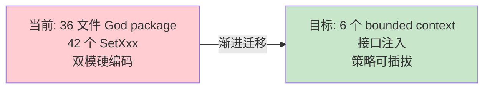
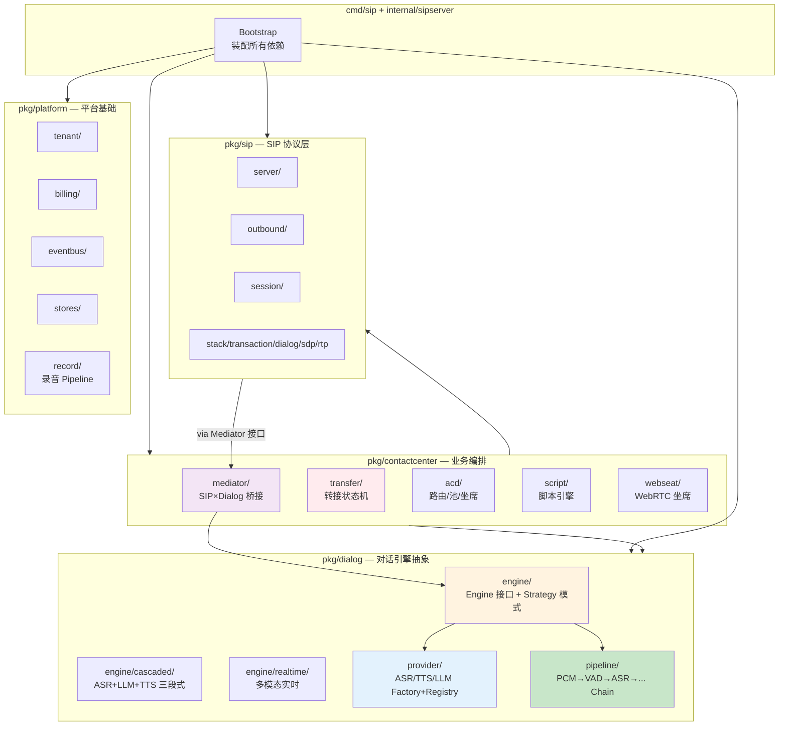
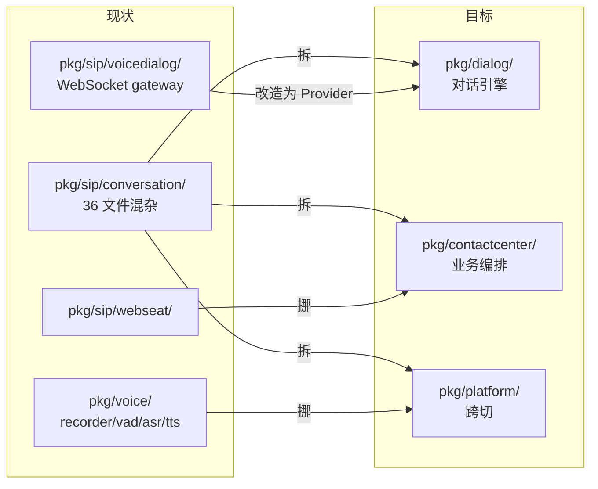
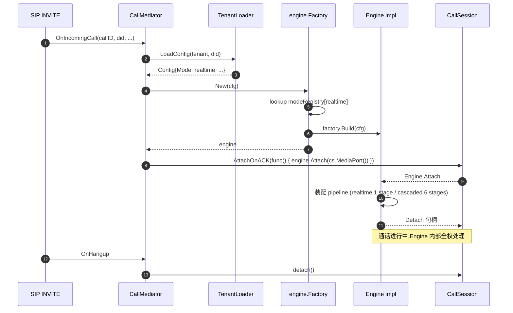
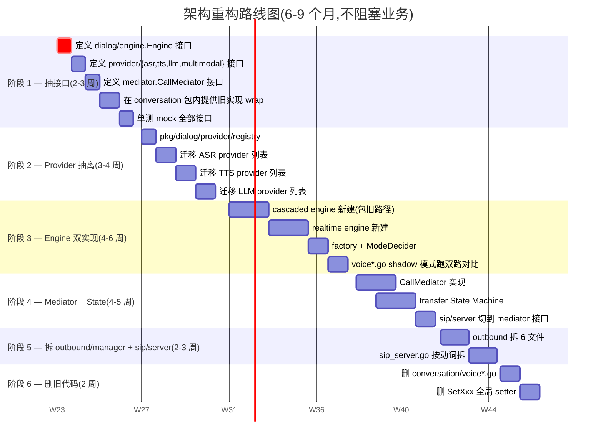
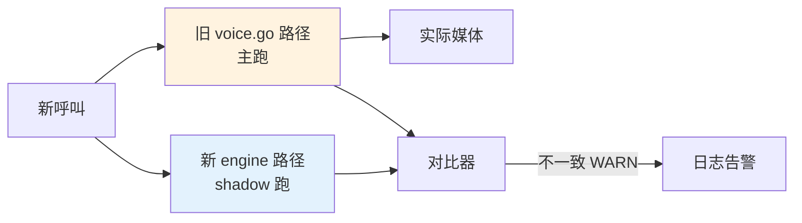
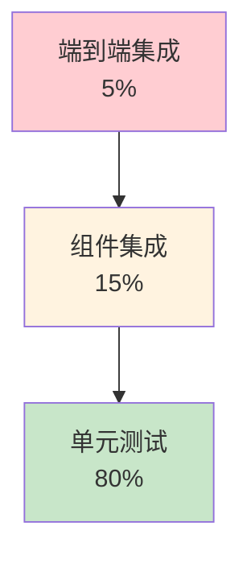

# LingEchoX 架构重构 RFC v2 — 优雅与可扩展

> 这是一份**架构级**重构提案,目标是把目前堆砌出来的 SIP / 语音 /
> 对话三层从"能跑"重构成"优雅、可扩展、可测试、可商业化"。
>
> 不是大爆炸式重写,而是**N 个小 PR 渐进迁移**,每一步都保留旧路径作为
> rollback,直到新架构稳定再删旧代码。
>
> 与现有文档分工:
>
> - `docs/refactor-rfc.md` — 业务流程层 RFC(转接路径 / callreg / codec 偏好)
> - `docs/refactor-history.md` — 底层包对齐到 VS 的工程历史
> - `docs/future-development.md` — 待修边界 + 大方向
> - **本文档** — 架构级重构 + 设计模式 + 渐进迁移路径

---

## 0. TL;DR

**当前的核心问题**:

1. `pkg/sip/conversation` 是个**God package**,36 个文件混着对话引擎 / 转接 /
   持久化 / 工具调用 / WebSeat handoff
2. **42 个 `SetXxx` 全局 setter** 跨 12 个文件,等于把"模块边界"用胶水糊起来
3. **对话双模(realtime vs cascaded ASR/LLM/TTS)硬编码 `if mode == "realtime"`**,
   两个 ~40K 行的姊妹文件 (`voice.go` + `voice_realtime.go`) 复制了一遍
   `SendToOutput / WriteAIPCM / barge-in / transfer` 接管逻辑
4. **outbound/manager.go 1240 行**,Dial / Auth / Refer / CDR / DTLS / Refresher
   全挤一起
5. **sip/server/sip_server.go 1622 行**,handleInvite/handleBye/handleAck/handle...
   都在同一个 SIPServer struct 上挂方法

**重构目标**(用 5 个设计模式撑起):

| 模式 | 解决什么 | 代码位置 |
|------|---------|---------|
| **Strategy** | 对话引擎 realtime ⇄ cascaded 切换 | `pkg/dialog/engine` |
| **Factory + Registry** | Provider(ASR/TTS/LLM)插件化 | `pkg/dialog/provider` |
| **Pipeline / Chain of Responsibility** | 媒体处理链 (PCM → VAD → ASR → ...) | `pkg/dialog/pipeline` |
| **Mediator** | SIP 协议层 ⇄ 对话引擎层解耦 | `pkg/contactcenter/mediator` |
| **State Machine** | 通话生命周期 / 转接状态 | `pkg/contactcenter/state` |



---

## 1. 现状诊断(代码引用)

### 1.1 conversation/ 是 God package

```
pkg/sip/conversation/  ← 36 文件,~250K 总字节
├── voice.go (44K)              ← cascaded 三段式入口
├── voice_realtime.go (33K)     ← realtime 多模态入口(姊妹文件)
├── voice_tenant_loader.go (16K) ← 租户配置加载
├── transfer.go (23K)
├── transfer_bridge.go (19K)
├── transfer_agent_events.go (12K)
├── transfer_refer.go (6K)
├── transfer_confirm.go (6K)
├── transfer_retarget.go (3K)
├── transfer_prompt.go (3K)
├── transfer_notify.go (1K)
├── realtime_intent.go (8K)     ← 意图检测(只 realtime 用)
├── realtime_tools.go (3K)
├── realtime_tool_handlers.go (7K)
├── asr_state.go (8K)           ← 只 cascaded 用
├── persist.go (1.6K)
├── welcome_resolver.go (6K)
├── webseat_handoff.go (2K)
├── wav_playback.go (4K)
└── ...

依赖关系: 谁也不知道,因为没有显式接口边界。
```

**问题**:
- 添加第三种对话模式(比如 ChatGPT Realtime + Whisper 混合)需要再创一个 `voice_xxx.go`
- 添加新 ASR Provider 要改 `voice.go` 内部分支
- 单测要 mock 至少 6-8 个全局 setter 才能跑

### 1.2 42 个全局 Setter

`pkg/sip/conversation/persist.go`:

```@/Users/cetide/Desktop/LingEchoX/pkg/sip/conversation/persist.go:1-50
package conversation
// ... SetWelcomeAudioResolver / SetSIPTurnPersist / SetCallStore
//     / SetInboundSessionLookup ...
```

每个 setter 都是这种形式:

```go
var fooFn func(...) ...
func SetFoo(fn func(...) ...) { fooFn = fn }
```

**问题**:
- 没有显式的 "ServiceContainer" 概念,谁初始化谁,顺序很脆
- 单元测试要在 setUp 时手工调 7-8 个 SetXxx,test fixture 重复成灾
- 多 instance(比如多租户独立 dialog 引擎)做不了,全局变量

### 1.3 对话双模硬编码

`@/Users/cetide/Desktop/LingEchoX/pkg/sip/conversation/voice.go:379-388`:

```go
func attachVoiceInner(ctx context.Context, cs *sipSession.CallSession, env VoiceEnv, lg *zap.Logger) error {
	if strings.EqualFold(env.VoiceMode, "realtime") {
		return attachRealtimeVoiceInner(ctx, cs, env, lg)
	}
	ms := cs.MediaSession()
	if ms == nil { ... }
	// ... 600 行 cascaded 三段式逻辑
}
```

`voice_realtime.go` 是 `voice.go` 的姊妹文件,两个文件各自实现:

| 共享逻辑 | voice.go 路径 | voice_realtime.go 路径 |
|---------|-------------|----------------------|
| MediaSession.SendToOutput | ✅ 自己写 | ✅ 自己抄一份 |
| CallSession.WriteAIPCM | ✅ | ✅ |
| barge-in 处理 | ✅ | ✅ |
| 转接接管(媒体停止/移交 RTP) | ✅ | ✅ |
| 录音 tap | ✅ | ✅ |
| 欢迎语播放 | ✅ | ✅(略有差异) |
| TTS 节拍/jitter snap | ✅ | ⚠️ realtime 用 provider 的) |
| 工具调用(transfer/hangup) | 通过 LLM tools | 通过 realtime intent |

**问题**:Provider 加一个、共享逻辑改一行,要改两边。

### 1.4 outbound/manager.go 1240 行

按文件大小:

```
pkg/sip/outbound/
├── manager.go (1240 行)  ← 全部塞这里
├── invite.go (294)
├── bye.go (138)
├── cancel.go (243, 新加的)
├── refresher.go
├── ack.go
├── peer.go
├── refer_parse.go
├── ... 30+ 文件
```

`manager.go` 里塞了:Dial / DialEvent emit / handleResponse / handleProvisional /
adoptDialogCallID / OnTransferBridge / startMedia / cleanupLeg / cdrEmit / DTLS / SRTP /
session timer refresher / signaling peer / capacity tracking / OnEvent / OnDialGate /
OnRegisterSession / OnEstablished / OnTransferBridge / outboundBYELegCleanup ...

按 VS 项目的拆分方式(`docs/refactor-history.md` D 节也有同样建议):

```
pkg/sip/outbound/
├── manager.go         ← 只剩生命周期 + 配置
├── dialer.go          ← Dial / 401 challenge / 重发
├── auth.go            ← Digest 计算
├── responses.go       ← handleResponse / 状态分流
├── refer.go           ← REFER 透传
├── refresher.go       ← session timer
└── ...
```

### 1.5 sip/server/sip_server.go 1622 行

类似问题。`SIPServer` struct 一个,handleInvite / handleAck / handleBye /
handleCancel / handleRefer / handleInfo / handleOptions / handleNotify /
handlePrack 都挂在它身上。

---

## 2. 目标架构

### 2.1 Bounded Context 划分



### 2.2 文件树(目标态)

```
pkg/
├── sip/                       ← SIP 协议层(底层,业务无关)
│   ├── server/                  UAS
│   ├── outbound/                UAC(拆 6-8 个文件)
│   ├── session/                 CallSession 基础
│   ├── stack/                   transaction / dialog / sdp / rtp
│   ├── bridge/                  双 leg 桥接
│   └── ...                      identity / historyinfo / ...
│
├── dialog/                    ← ★新★ 对话引擎(纯逻辑,SIP 无关)
│   ├── engine/
│   │   ├── engine.go              Engine interface (Strategy)
│   │   ├── factory.go             EngineFactory + ModeRegistry
│   │   ├── cascaded/              ASR+LLM+TTS pipeline
│   │   │   ├── engine.go          impl Engine
│   │   │   ├── orchestrator.go    Turn = ASR-final → LLM → TTS
│   │   │   └── barge_in.go
│   │   ├── realtime/              全双工多模态
│   │   │   ├── engine.go          impl Engine
│   │   │   ├── intent.go          tool/intent 解析
│   │   │   └── adapters/          Qwen / GPT-4o / Doubao
│   │   └── hybrid/                未来:可混合 cascade + realtime
│   │
│   ├── provider/                Provider 插件
│   │   ├── registry.go            全局 Registry(Builder 模式)
│   │   ├── asr/                   ASRProvider 接口 + 实现
│   │   ├── tts/                   TTSProvider 接口 + 实现
│   │   ├── llm/                   LLMProvider 接口 + 实现
│   │   └── multimodal/            RealtimeProvider 接口 + 实现
│   │
│   ├── pipeline/                媒体管道(Chain of Responsibility)
│   │   ├── pipeline.go            Stage interface, Pipeline struct
│   │   ├── stages/
│   │   │   ├── vad.go
│   │   │   ├── asr.go             以 Stage 形式包 ASRProvider
│   │   │   ├── llm.go
│   │   │   ├── tts.go
│   │   │   ├── recorder.go
│   │   │   └── barge_in.go
│   │   └── tap.go                 PCM tap (诊断/录音)
│   │
│   ├── tools/                   LLM/realtime 共享 tool 调用
│   │   ├── tool.go                Tool interface
│   │   ├── transfer.go            transfer_to_agent
│   │   ├── hangup.go              hangup_call
│   │   └── lookup.go              CRM 查询等
│   │
│   └── turn/                    对话轮抽象
│       ├── turn.go                Turn struct + builder
│       └── persistence.go
│
├── contactcenter/             ← ★新★ 业务编排层
│   ├── mediator/
│   │   ├── mediator.go            CallMediator (Mediator 模式)
│   │   ├── inbound.go             inbound INVITE → 装配 dialog
│   │   ├── outbound.go            campaign / transfer 出局
│   │   └── observer.go            CallLifecycleObserver 事件
│   │
│   ├── transfer/                 (从 conversation/transfer*.go 迁出)
│   │   ├── state.go               TransferState (State 模式)
│   │   ├── orchestrator.go        编排 ringback / dial / bridge
│   │   ├── refer.go               REFER 路径
│   │   ├── confirm.go
│   │   └── notify.go
│   │
│   ├── acd/                      路由 / 池 / 坐席
│   │   ├── pool.go
│   │   ├── selector.go            选 ACD target(Strategy)
│   │   └── webseat_heartbeat.go
│   │
│   ├── script/                   脚本引擎
│   │   ├── runtime.go
│   │   ├── node.go                Node interface(Visitor)
│   │   └── nodes/                 各类节点
│   │
│   ├── webseat/                  WebRTC 坐席(从 sip/webseat 迁来)
│   │   └── ...
│   │
│   └── campaign/                 外呼活动
│       └── ...
│
└── platform/                  ← 跨切关注点
    ├── tenant/
    ├── billing/                  (前面 commercialization 提的)
    ├── license/
    ├── eventbus/
    ├── stores/
    └── record/                   录音(从 voice/recorder 迁来)
```

### 2.3 跟现状对比



---

## 3. 核心设计模式应用

### 3.1 Strategy — 对话引擎切换

```go
// pkg/dialog/engine/engine.go
package engine

type Engine interface {
    // Attach 绑定到一个 CallSession,返回 Detach 函数。
    // 调用方不感知后面是 cascaded 还是 realtime。
    Attach(ctx context.Context, cs MediaPort, lg *zap.Logger) (Detach, error)
}

type Detach func() error

// MediaPort 是 Engine 所需的最小媒体能力,与 SIP 解耦。
// sip/session.CallSession 实现这个接口(适配器模式)。
type MediaPort interface {
    InputPCM() <-chan PCMFrame   // 用户语音流入
    SendOutputPCM(PCMFrame) error // AI 语音流出
    OnBargeIn(func())             // 用户开口回调
    Codec() codec.Spec
    SampleRate() int
}

// Mode 是对话引擎选型。
type Mode string

const (
    ModeCascaded Mode = "cascaded"
    ModeRealtime Mode = "realtime"
    ModeHybrid   Mode = "hybrid"
)
```

```go
// pkg/dialog/engine/factory.go
package engine

type Factory interface {
    Build(cfg Config) (Engine, error)
}

type Config struct {
    Mode     Mode
    Tenant   tenant.ID
    Provider ProviderRefs       // ASR/TTS/LLM/Realtime 的引用
    Tools    []tools.Tool
    Welcome  WelcomeSpec
}

// 全局注册表 — Provider 模式
var modeRegistry = map[Mode]Factory{}

func Register(mode Mode, f Factory) { modeRegistry[mode] = f }

func New(cfg Config) (Engine, error) {
    f, ok := modeRegistry[cfg.Mode]
    if !ok { return nil, ErrUnknownMode }
    return f.Build(cfg)
}
```

**新增第三种模式**(比如 GPT-4o realtime + Whisper 备份)只要:

```go
// pkg/dialog/engine/hybrid/factory.go
func init() {
    engine.Register(engine.ModeHybrid, factory{})
}
```

### 3.2 Factory + Registry — Provider 插件化

```go
// pkg/dialog/provider/asr/asr.go
package asr

type Provider interface {
    Open(ctx context.Context, cfg StreamConfig) (Stream, error)
    Name() string
}

type Stream interface {
    Push(pcm []byte) error
    Results() <-chan Result
    Close() error
}

type Result struct {
    Text     string
    IsFinal  bool
    Confidence float64
}
```

```go
// pkg/dialog/provider/registry.go
type Builder[T any] func(cfg ProviderConfig) (T, error)

type Registry[T any] struct {
    mu       sync.RWMutex
    builders map[string]Builder[T]
}

func (r *Registry[T]) Register(name string, b Builder[T]) { ... }
func (r *Registry[T]) Build(name string, cfg ProviderConfig) (T, error) { ... }

var (
    ASRRegistry  = &Registry[asr.Provider]{}
    TTSRegistry  = &Registry[tts.Provider]{}
    LLMRegistry  = &Registry[llm.Provider]{}
    RTRegistry   = &Registry[multimodal.Realtime]{}
)
```

每个具体 Provider 用 `init()` 自注册:

```go
// pkg/dialog/provider/asr/qcloud/qcloud.go
func init() {
    asr.ASRRegistry.Register("qcloud", New)
}
```

**好处**:
- 新增 Provider 只加一个文件 + 一行 init,无需改其他代码
- 编译时 build tag 可裁剪(信创版剔除海外 Provider)
- 单测可注册 fake Provider,不需要改业务代码

### 3.3 Pipeline — 媒体处理 Chain

```go
// pkg/dialog/pipeline/pipeline.go
type Stage interface {
    // Process 处理单帧或事件,可选地产出新帧/事件给下一个 Stage。
    Process(ctx context.Context, in StageIO) (StageIO, error)
    Name() string
}

type Pipeline struct {
    stages []Stage
}

func (p *Pipeline) Run(ctx context.Context, in <-chan StageIO) <-chan StageIO { ... }

// 典型 cascaded 装配
func BuildCascaded(cfg Config) *Pipeline {
    return &Pipeline{
        stages: []Stage{
            stages.NewVAD(cfg.VADParams),
            stages.NewASR(cfg.ASRProvider),
            stages.NewTurnAggregator(),
            stages.NewLLM(cfg.LLMProvider, cfg.Tools),
            stages.NewTTS(cfg.TTSProvider),
            stages.NewBargeInGuard(),
        },
    }
}

// realtime 模式 pipeline 退化为 1 个 stage
func BuildRealtime(cfg Config) *Pipeline {
    return &Pipeline{
        stages: []Stage{
            stages.NewMultimodalRealtime(cfg.RTProvider, cfg.Tools),
        },
    }
}
```

**好处**:
- 在 ASR 后插一个"敏感词过滤" stage,只加 1 个文件
- "录音 tap"也是个 stage,不需要在每条路径手工挂
- 切换 cascaded ⇄ realtime 只是换一组 stages

### 3.4 Mediator — SIP × Dialog 解耦

现状:`sip/server/sip_server.go` 直接调 `conversation.AttachVoicePipeline`、
`conversation.HangupTransferBridgeIfAny`、`conversation.HandleSIPINFODTMF` 等
~11 个业务函数,不可能独立测试。

```go
// pkg/contactcenter/mediator/mediator.go
package mediator

// CallMediator 是 SIP 协议事件 → 业务编排的中央仲裁者。
// SIP 层只发事件,业务层只听事件,互不直接 import。
type CallMediator interface {
    OnIncomingCall(IncomingCallEvent)
    OnAnswered(callID string)
    OnDTMF(callID string, digit byte)
    OnRefer(callID string, target string)
    OnHangup(callID string, by Initiator, reason string)
    OnRecordingComplete(callID string, info RecordingInfo)
}

// 默认实现编排:
//   - 拉租户配置 → engine.Build → engine.Attach
//   - 启动 transfer / script / persistence 等 sub-flow
type defaultMediator struct {
    engineFactory engine.Factory
    tenants       tenant.Loader
    transfer      transfer.Orchestrator
    persist       persist.CallStore
    eventbus      eventbus.Publisher
    // ...
}
```

`sip/server` 只持有 `CallMediator` 接口引用:

```go
// pkg/sip/server/sip_server.go
type SIPServer struct {
    mediator mediator.CallMediator  // ← 唯一的业务出口
    // ... 所有 SetXxxHandler 全部消失
}
```

### 3.5 State Machine — 转接 / 通话生命周期

现状:转接状态散落在 `transferStarted sync.Map` / `transferRingStop` /
`transferNoAgentRetry` / `transferPendingOutbound` / `webSeatJoinTimers`...
读起来像考古。

```go
// pkg/contactcenter/transfer/state.go
type State string

const (
    StateIdle        State = "idle"
    StateRequested   State = "requested"      // 用户/AI 触发
    StateRinging     State = "ringing"        // 给用户播 ringback
    StateAgentDialing State = "agent_dialing" // INVITE 已发
    StateAgentRinging State = "agent_ringing" // 收到 1xx
    StateBridged     State = "bridged"
    StateCancelled   State = "cancelled"
    StateFailed      State = "failed"
    StateRetrying    State = "retrying"
)

type Event interface{ event() }

type EventInboundHangup struct{}
type EventAgentInvited struct{ OutCallID string }
type EventAgentProvisional struct{}
type EventAgentEstablished struct{ OutCallID string }
type EventAgentFailed struct{ Code int; Reason string }
type EventRingTimeout struct{}

// FSM 用类型断言分发,写起来比 sync.Map 清楚 10 倍
type Machine struct {
    state State
    ctx   *Context
}

func (m *Machine) Handle(e Event) error {
    switch m.state {
    case StateAgentDialing:
        return m.handleDialing(e)
    case StateAgentRinging:
        return m.handleRinging(e)
    // ...
    }
}
```

转接状态、6 个 race 边界、CANCEL 时机、ring-timeout 兜底,**全部用一个状态机
表达**,而不是分散在 4 个 sync.Map + 3 处 mutex。

---

## 4. 双模(realtime ⇄ cascaded)优雅切换

### 4.1 切换的 4 个关键节点



### 4.2 切换决策(声明式,不再是 if 散落)

```go
// pkg/contactcenter/mediator/mode_decider.go
type ModeDecider interface {
    Decide(ctx context.Context, callContext CallContext) engine.Mode
}

// 默认实现:租户配置 → DID 覆盖 → A/B 实验 → fallback
type defaultDecider struct {
    tenants     tenant.Loader
    overrides   DIDOverrides
    abExperiments ABRouter
}

func (d *defaultDecider) Decide(ctx context.Context, cc CallContext) engine.Mode {
    // 1. 租户级配置(从 DB)
    tcfg, _ := d.tenants.Load(ctx, cc.TenantID)

    // 2. DID 覆盖(某些线路只走 cascaded — 如客户要求录音哈希存证)
    if m, ok := d.overrides.For(cc.DID); ok { return m }

    // 3. A/B 实验(灰度 10% 流量到 realtime)
    if d.abExperiments != nil {
        if m, ok := d.abExperiments.Route(cc); ok { return m }
    }

    // 4. fallback
    return tcfg.DefaultMode
}
```

### 4.3 跨模式共享逻辑(消除复制)

当前两个 voice*.go 复制的逻辑,抽到 `pkg/dialog/engine/common`:

```go
// pkg/dialog/engine/common/media_adapter.go
// MediaAdapter 把 sip/session.CallSession 适配成 engine.MediaPort,
// 同时管理录音 tap / barge-in 信号 / 转接接管时的媒体切换。
type MediaAdapter struct {
    cs        *session.CallSession
    bargeFn   atomic.Pointer[func()]
    recordTap RecordTap
    onTransfer atomic.Pointer[TransferTakeover]
}

func (a *MediaAdapter) InputPCM() <-chan PCMFrame { ... }
func (a *MediaAdapter) SendOutputPCM(f PCMFrame) error { ... }
// ... 这些代码现在在 voice.go 和 voice_realtime.go 各一份,合并到这里
```

cascaded 引擎和 realtime 引擎都用同一个 `MediaAdapter`,消除两套 ~600 行
副本。

---

## 5. 渐进迁移路线图

**关键原则**:每个 PR ≤ 1000 行 diff,旧路径作 fallback,可独立验证。



### 5.1 阶段 1:抽接口(无行为变更)

- 创建 `pkg/dialog/engine/engine.go`,只放接口定义
- 创建 `pkg/dialog/provider/{asr,tts,llm}/types.go`,只放接口
- 现有 `conversation` 包加一个 `legacyAdapter.go` 实现这些接口,内部委托给老函数
- 业务代码先全部依赖接口,实际指向 legacyAdapter
- **不删任何代码**,行为不变,只是接口先就位

PR 大小:300-500 行 / 1 个 PR / 1 周

### 5.2 阶段 2:Provider 抽离

- `pkg/dialog/provider/registry.go` + 8+ Provider 各自 init 注册
- `voice.go` 现在 import provider registry 而不是直接 import 各 SDK
- 单测可以注册 fake provider 不再启动真服务

PR 大小:500-800 行 / 3-4 个 PR(ASR / TTS / LLM 各一)

### 5.3 阶段 3:Engine 双实现 + Shadow Mode



env `DIALOG_ENGINE_MODE=shadow`(默认)→ 老路径输出真实媒体,新路径只对比
ASR/LLM/TTS 时序与文本,不一致 WARN。

跑稳定 1-2 周后切 `primary` → 新路径主跑、老路径关闭。再观察 1-2 周即可
删除老代码。

### 5.4 阶段 4:Mediator + State Machine

- `pkg/contactcenter/mediator/mediator.go` 实现 `CallMediator`
- `pkg/contactcenter/transfer/state.go` 实现转接 FSM
- `sip/server` 内置 `CallMediator` 字段;在 cmd 装配时注入
- `conversation/transfer*.go` 内部仍可保留逻辑但通过 mediator 调

### 5.5 阶段 5:拆大文件

按 VS 风格:`outbound/manager.go` → 6 文件,`sip/server/sip_server.go` →
按 method 拆。这两个动作的细节已经在 `docs/refactor-history.md` D 节有计划。

### 5.6 阶段 6:删除旧路径

- `conversation/voice.go` / `voice_realtime.go` 删除
- 42 个 `SetXxx` 全局 setter 删掉
- `conversation` 包整体迁到 `contactcenter/`

---

## 6. 测试与可观测性

### 6.1 测试金字塔(目标)



- **单元**:每个 Engine / Provider / Stage / FSM 都有专属 test,mock 走 fake
  Provider/MediaPort
- **组件集成**:`mediator` 配 `engine.cascaded` + fake providers,跑一通完整
  对话(无真 SIP 包)
- **端到端**:`pkg/sip/server/scenario_udp_test.go` 风格,真 SIP 帧 + 真音频

### 6.2 可观测性接入

每个 stage 都有 `Name()` 方法 → 自动按 stage 打 metrics:

```
dialog_stage_duration_seconds{engine="cascaded", stage="asr", provider="qcloud"}
dialog_stage_errors_total{engine="cascaded", stage="llm", provider="openai"}
dialog_engine_attached{tenant="xxx", mode="realtime"}
```

转接 FSM 状态:

```
transfer_state_transitions_total{from="ringing", to="cancelled", trigger="inbound_hangup"}
```

---

## 7. 风险与缓解

| 风险 | 缓解 |
|------|------|
| **重构期间引入回归** | 阶段 3 shadow mode 强制双路对比 1-2 周 |
| **性能下降(多一层接口)** | 接口都是 channel + 函数引用,几乎零开销;基准测试守门 |
| **迁移期同时维护两份代码** | 严格的阶段时间表,阶段 6 删除是硬性收尾 |
| **业务侧需求打断重构** | 每阶段 ≤ 6 周;新需求可在新接口上做(不再加到老代码) |
| **设计模式过度工程化** | 仅在被反复修改的地方引入(转接、对话引擎、Provider);其他一刀流 |

---

## 8. 设计模式速查

| 模式 | 用在哪 | 解决什么 |
|------|-------|---------|
| **Strategy** | `engine.Engine` | cascaded ⇄ realtime 替换 |
| **Factory** | `engine.Factory`, `provider.Builder` | 实例化解耦 |
| **Registry** | `provider.Registry`, `engine.modeRegistry` | 插件自注册 |
| **Chain of Responsibility** | `pipeline.Pipeline` | 媒体处理流水线 |
| **Mediator** | `mediator.CallMediator` | SIP × 业务解耦 |
| **State** | `transfer.Machine` | 转接生命周期 |
| **Adapter** | `MediaAdapter` | sip.CallSession → engine.MediaPort |
| **Observer** | `eventbus.Publisher` | 通话事件外推 |
| **Builder** | `provider.Config{...}.Build()` | 复杂 Provider 配置 |
| **Decorator** | pipeline 各 Stage | 录音 tap、metrics 埋点透明叠加 |

---

## 9. 立即行动(本月)

### 阶段 1 第 1 个 PR(本周可起)

只做接口定义,**零行为变更**:

```
新建文件:
  pkg/dialog/engine/engine.go         (~80 行)
  pkg/dialog/engine/factory.go        (~40 行)
  pkg/dialog/engine/types.go          (~60 行)
  pkg/dialog/provider/asr/asr.go      (~50 行)
  pkg/dialog/provider/tts/tts.go      (~50 行)
  pkg/dialog/provider/llm/llm.go      (~50 行)
  pkg/dialog/provider/multimodal/realtime.go (~50 行)
  pkg/dialog/provider/registry.go     (~80 行)
  pkg/contactcenter/mediator/mediator.go (~100 行)

修改文件:
  无

测试:
  pkg/dialog/engine/engine_test.go    (~50 行,验证接口约束)
```

确认接口设计 OK 后再走 PR-2(legacy adapter 实现)。

### 验收标准

- 每个 PR `go build ./...` + `go vet ./...` + `go test ./...` 全绿
- 每个阶段结束跑一次 `scenario_udp_test.go` 真 SIP 端到端验证
- 阶段 3 必须 shadow mode 双跑日志对比 ≥ 7 天

---

## 10. 后续派生文档

完成本 RFC 设计后,需要派生 5 份子文档:

1. `docs/dialog-engine-spec.md` — Engine / Provider 接口契约 + 兼容性约定
2. `docs/dialog-pipeline-stages.md` — 内置 Stage 清单 + 自定义 Stage 编写指南
3. `docs/transfer-state-machine.md` — 转接 FSM 完整状态图 + 事件矩阵
4. `docs/sip-mediator-events.md` — SIP × Mediator 事件契约
5. `docs/migration-checklist.md` — 阶段 1-6 每步的验收 checklist

---

> 本文档目标是**在不破坏当前可商业化进度的前提下**,把代码长大成"可以
> 让 5 个工程师并行工作而不互相踩脚"的样子。每个阶段都有清晰的 done
> 标准,不允许"边重构边带新功能"。
>
> 如果重构与商业化抢资源,**优先保商业化**(详见 `docs/commercialization.md`),
> 重构可以慢做但不能停。
