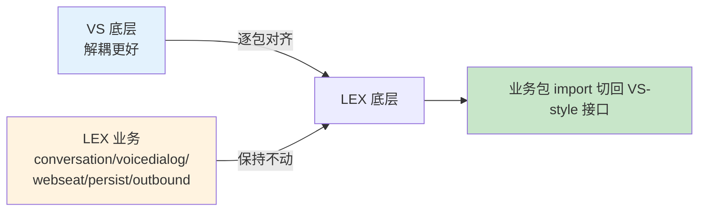
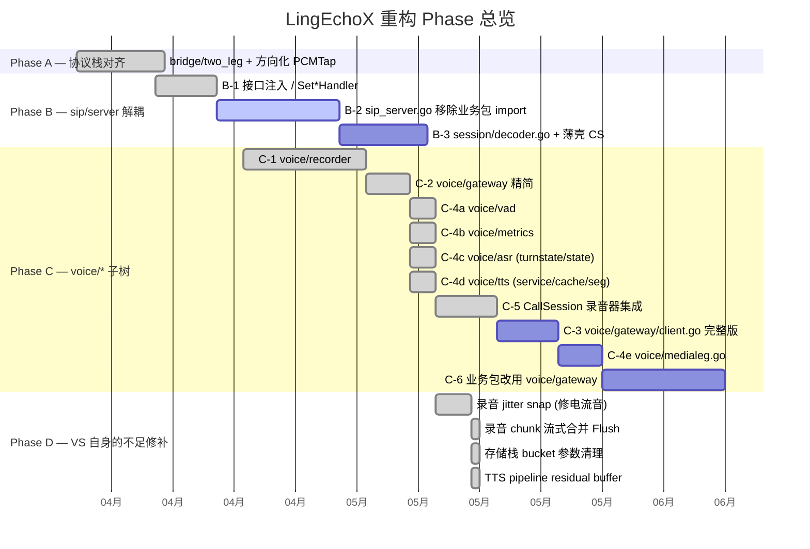
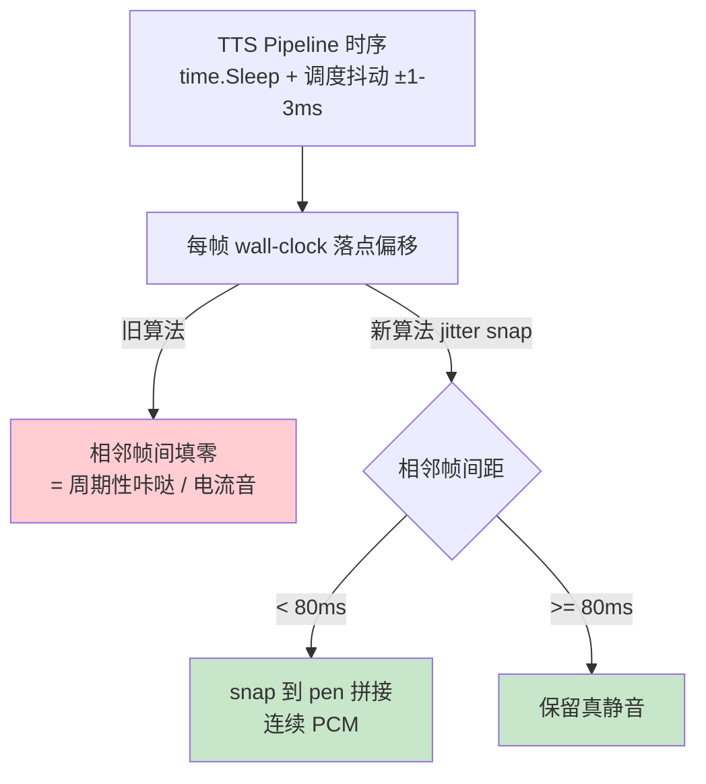
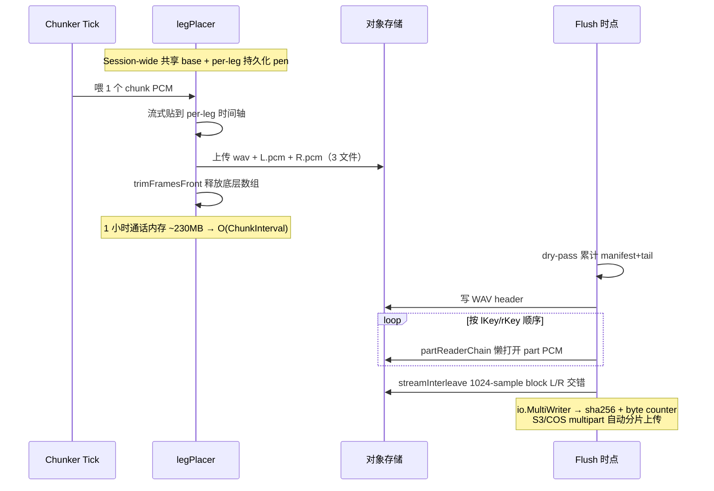
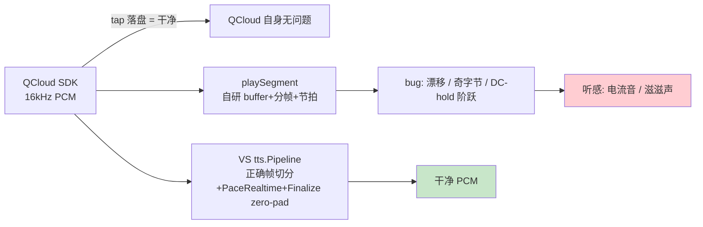

# LingEchoX 底层重构与对齐历史

> 本文档由 `docs/internal/refactor-progress-notes.txt` 整理而来，记录 LingEchoX
> 从 VoiceServer (VS) 底层对齐 / 复刻过程中的关键决策、已完成任务与遗留事项。
> 旨在让新加入工程的同学能快速理解：哪些包是新写的、哪些是从 VS 移植的、
> 哪些性能 / 音质 bug 已经被修过、为什么改成那样。

---

## 1. 背景与策略

LingEchoX (LEX) 与 VoiceServer (VS) 共用同一 Go module path
`github.com/LinByte/VoiceServer`。VS 在底层 SIP / 媒体协议栈上比 LEX 解耦更
彻底（业务通过 `InviteHandler` 接口注入、录音抽到 `pkg/voice/recorder`
统一立体声 WAV）；LEX 业务侧更丰富（`conversation` / `voicedialog` /
`webseat` / `persist` / `outbound` 等流程）。

**重构总策略**：



- 保持 LEX 业务包不动，先把底层撑起来。
- 底层 (`sip/*` + `voice/*`) 逐包对齐到 VS，再把业务侧的 import 切回去。
- 每完成一档就跑 `go build ./...`；不允许任何持续编译失败。

---

## 2. 已对齐的底层包（基本零差异）

| 包 | 状态 | 备注 |
|----|------|------|
| `pkg/sip/uas` | ✅ 对齐 | 无差异 |
| `pkg/sip/dtmf` | ✅ 对齐 | 无差异 |
| `pkg/sip/dialog` | ✅ 对齐 | 无差异 |
| `pkg/sip/sdp` | ✅ 对齐 | 无差异 |
| `pkg/sip/rtp` | ✅ 对齐 | 无差异 |
| `pkg/sip/transaction` | ✅ 对齐 | 仅空白格式差异 |
| `pkg/sip/stack` | ✅ 对齐 | LEX 多 1 个 18 行 `pcm.go` 工具函数，保留 |

---

## 3. 重构 Phase 全景



---

## 4. Phase 详细记录

### 4.1 Phase A — 协议栈对齐（安全 / 加法）

- **`pkg/sip/bridge/two_leg.go`** — 合并 VS 的 `BridgeDirection` / `PCMTapFunc` /
  `SetDirectionalPCMTap`。
- **`pkg/sip/bridge/two_leg_relay.go`** — 对齐 VS 版本。

### 4.2 Phase B — sip/server 解耦

- **B-1 已完成**：拷入 VS `interfaces.go` / `incoming.go` / `compat.go`
  （共存模式，添加字段不破现有调用）。
  - `SIPServer` struct 新增：`inviteHandler` / `dtmfSink` /
    `transferHandler` / `callObserver` / `terminateHooks`
  - 提供 `Set{Invite,DTMFSink,Transfer,CallLifecycle}Handler` 注入入口。
  - `endVoiceDialogBridge` 合并：同时走 `voicedialog.EndCall`（旧）+
    `fireOnTerminate`（新）。
- **B-2 待完成**：`sip_server.go` 移除对 `conversation` / `voicedialog` 的直接
  import；需要在 `conversation` 包增加 wrapper 实现 `CallLifecycleObserver` 等。
- **B-3 待完成**：拷入 VS `pkg/sip/session/decoder.go`；`call_session.go`
  重构为薄壳。

**风险点**：`sip_server.go` 对 `conversation` 包有 ~11 个直接调用点：
`cleanupCallState` / `HangupTransferBridgeIfAny` / `HangupWebSeatBridgeIfAny` /
`ActiveTransferBridgeForCallID` / `ActiveWebSeatSession` /
`TeardownTransferBridge*` / `HandleSIPINFODTMF` /
`TriggerTransferFromReferTo` —— 需逐一映射。

### 4.3 Phase C — voice/* 子树（大部分新增）

#### C-1 `pkg/voice/recorder` ✅

统一立体声 WAV，含 chunk rolling upload；从 VS 拷入但解耦了对 `gateway` 的
强依赖。

#### C-2 `pkg/voice/gateway/types.go` + `persistence.go` ✅

精简版：把 `TurnEvent` 从 `client.go` 提到 `persistence.go`，让 recorder 不
需要拉 `vad` / `metrics`。

#### C-4 子模块并行 ✅

- **C-4a `pkg/voice/vad`** — VS 完整 detector 拷入，与 LEX `pkg/sip/vad` 并存。
- **C-4b `pkg/voice/metrics`** — VS 完整 metrics + app 拷入。
- **C-4c `pkg/voice/asr/{turnstate,state,sentence_filter}.go` + 测试** ——
  与 LEX 现有 `pipeline.go` 共存。
- **C-4d `pkg/voice/tts/{service,cache,segmenter}.go` + 测试** —— 删除
  `pipeline.go` 重复 `Service` 接口、重命名 `fakeService` 避免测试冲突。

#### C-5 CallSession 录音器集成 ✅

`pkg/sip/session/call_session.go` 新方法：

- `EnableRecorder` / `WriteCallerPCM` / `WriteAIPCM` / `FlushRecorder`
- `attachVoiceInner` 自动启用（`SIP_RECORDER_DISABLE=1` 关闭，
  `SIP_RECORDER_CHUNK_SECS` / `SIP_RECORDER_BUCKET` 调参）
- TTS `SendPCMFrame` + ASR proc 两侧 PCM tap 已接通
- `ByePersistParams.WAVRecording` 新字段；BYE 路径自动 Flush
- webseat `FinalizeInboundPersist` 回调签名扩展 `wavRec`
- persister 优先消费 `WAVRecording`，跳过 SN3 → WAV 解码
- SN3 buf 与新录音并行，作为 `RawPayload` fallback（暂不删除）
- 新增 `pkg/sip/session/recorder_test.go` 覆盖 nil-safe + 全链路 flush

#### C-3 / C-4e / C-6 — 待完成

- **C-3 `pkg/voice/gateway/client.go` 完整版** —— 依赖 `voice/vad` /
  `voice/metrics` / `voice/medialeg`。
- **C-4e `pkg/voice/medialeg.go`** —— 需 LEX `asr/tts` pipeline.go API 兑齐 VS，
  生效需同步重构 `conversation/voice.go`。
- **C-6 业务包改用 `voice/gateway`** —— 而不是直接调 SIP session。

### 4.4 Phase D — VS 自身的不足修补

VS 移植过来后，发现一系列 VS 原版没修过的录音 / TTS 问题，逐条修复。

#### D-1 录音 chunk rolling 改成基于"已编码 size"

- 待完成：基于 chunker tick 容易出半空 chunk。

#### D-2 `RecordingInfo.Hash` 填充 ✅

- VS 原版 `Hash` 字段完全没填过；本处补齐 `sha256:<hex>`。
- `SIPCall` 表新增 `recording_hash` 列；persister 同步写入。

#### D-3 录音电流音根治：TTS 帧 jitter snap ✅



- 旧版用"裸 wall-clock 网格"贴帧，相邻帧 ±1-3ms 错位被填零 → 20ms 周期 click。
- 新版：相邻帧 wall 间距 `<` `SIP_RECORDING_JITTER_SNAP_MS`（默认 80ms）一律 snap 到
  pen 连续拼接；`>=` 阈值才保留为真静音。
- 同步修复 `pkg/sip/session/utils/sip_recording_wav.go::placeWallPCMTrack` 老路径。
- 新增 `utils.RecordingJitterSnapNs()` 共享 helper。
- 回归测试：`TestPlacePCMTrackBytes_JitterSnap` / `RealSilencePreserved` /
  `TestSN3_G711Stereo_JitterSnap_ContiguousTTS`。

#### D-4 录音 append 丢弃奇数尾字节 ✅

避免 16-bit 样本 high/low 字节互换。

#### D-5 voice.go resample 失败兜底 ✅

- resample 失败时不再以错误采样率写 recorder（避免 pitch-shift 静电）。
- `playWelcomeWav` 接入 `recordTap`，欢迎语不再录音缺失。
- `streamPlainTextToTTS` 同步接入 `cs.WriteAIPCM`。

#### D-6 录音分片上传 + 流式合并 Flush（C 方案）✅ — 2026-05-16

彻底重构 `pkg/voice/recorder` 的录音存储路径：



- **Session-wide 共享 base + per-leg 持久化 pen**：新增 `legPlacer` 流式放置器，
  跨多次 chunker tick 维护连续 per-leg 时间轴；`sessionBaseNs` 在第一帧
  lazy-set，所有后续 chunk 共享 t=0。
- **每 chunk 三文件**：wav (playable, ops afplay 可直接听) + `-L.pcm` /
  `-R.pcm`，前者独立可播放，后两者为最终合并提供按字节顺序拼接源。`manifest`
  (chunkManifest) 在内存维护，按 seq 排序。
- **真帧驱逐**：chunker 上传成功后 `trimFramesFront` 重新分配
  `inSegs` / `outSegs` 切片，释放底层数组让 GC 回收已放置的 PCM 字节。1 小时
  通话（16k 立体声）内存峰值从 ~230MB → ~O(ChunkInterval)。
- **流式 Flush**：通过 `io.Pipe` + writer goroutine：
  - dry-pass 累计 manifest+tail 算总长度，写 WAV header
  - `partReaderChain` 懒打开每个 part PCM（任意时刻只有 1 个 HTTP body 流），
    按 lKey/rKey 顺序拼成 leftReader/rightReader
  - `streamInterleave` 按 1024-sample block 交错合并 L/R 写入 pipe，
    `io.MultiWriter` 同步喂给 sha256 hasher 和 byte counter
  - `store.Write(key, pipeReader)` 并发消费 — S3/COS 等支持 multipart 的后端
    会自动分片上传，本地盘流式落文件
  - 失败回退：`pr.CloseWithError` 优雅取消 writer goroutine 防泄漏
- **并发安全**：chunker 与 Flush 竞态用 `r.flushed` 标志保护 — Flush 期间
  chunker 上传完检测到 `flushed=true` 自删 3 个 orphan 文件，不会双放置 / 丢帧；
  Flush 自己用最新 placer state 处理 tail frames。
- **回归测试 3 个**：
  - `TestRecorder_ChunkedFlushEqualsMonolithic` — 分片+流式 Flush vs 单次内存 Flush
    在相同输入下输出大小 ±2% 一致
  - `TestRecorder_FrameEvictionBoundedMemory` — 50 帧/500ms 输入，chunker 跑完
    `inSegs/outSegs` 残留 ≤10 帧
  - `TestRecorder_StreamMergeFromExistingParts` — 白盒构造 manifest + 手塞 part
    PCM，验证 `partReaderChain` 在 chunk 边界、leg-长度不等、L 提前耗尽等场景下
    逐 sample 拼接正确

#### D-7 存储栈瘦身：移除 typed StorageConfig / 全部 bucket 参数 ✅ — 2026-05-16

`pkg/stores Store` 接口已改为：

```go
Write(key, r)
Read(key)
Delete(key)
Exists(key)
PublicURL(key)
```

后端（`cos` / `s3` / `oss` / `minio` / `qiniu` / `local`）自己持有 `BucketName`
字段从环境变量读取，调用方一律不再传 bucket。同步清理：

- `pkg/config/config.go` 删除 `StorageConfig` 结构体与 `ServicesConfig` 里对应
  字段，同时去掉 `GlobalConfig → os.Setenv` 的双向 mirroring
- `pkg/voice/recorder.Config` 删除 `Bucket` 字段；Flush 改用
  `stores.PublicObjectURL` 解析 URL，找不到 PublicURL 时回退到 raw key
- `pkg/voice/gateway.RecordingInfo` 删除 `Bucket` 字段
- `pkg/sip/persist/call_store.go` 去掉 `STORAGE_BUCKET` env 桥接
- `pkg/sip/conversation/voice.go` 删除 `SIP_RECORDER_BUCKET` 处理
- `pkg/stores/{object_url,resolve_upload}.go` 函数签名删 `bucketName`
- `internal/handlers/tenant_users.go` 上传头像同步收敛
- 测试侧 `memStore` / `fakeStore` 接口签名同步更新

#### D-8 TTS 电流音诊断 + 终修 ✅ — 2026-05-16

逐级二分定位"为什么 TTS 听感持续电流音"，最终改成"整段用 VS `tts.Pipeline`"。



具体修法：

1. **诊断 tap**：新增 `voicedialog/tts_raw_dump.go`，在 prefetch goroutine
   里 SDK callback 一收到 PCM 就以 16-bit mono WAV 直接落盘，绕开所有
   `framer/resample/encode/RTP`。`SIP_TTS_RAW_DUMP_DIR=/path` 启用。
2. **`cloudSR` 默认回退到桥接率**：避免不必要的 16k→8k 降采（2-tap 平均无抗
   混叠 LPF，反而是污染源）。
3. **`playSegment` 整体替换为 VS `tts.Pipeline`**：用户反馈"welcome.wav 干净、
   上行录音干净、唯独 TTS 有电流音"——锁定到 `playSegment` 自己重新发明了一遍
   「buffer + 分帧 + 节拍 + 兜底」。新做法：注入 `chanReplayService` 把 prefetch
   的 `pcmCh` 对接给 `siptts.Pipeline`，Pipeline 负责帧切分、`PaceRealtime` 节拍、
   `Finalize` 段尾 zero-pad。**保留** prefetch goroutine（段间 SDK 握手并行优化）。
   `chanReplayService` 同时做：
   - `cloudSR != bridgeSR` 时缓冲全段后**整段重采样**（避开
     `InterpolatingConverter` 每 chunk 重置 `sourcePos` 的相位错位）
   - 防御性丢弃奇字节 chunk
4. **移除 underrun DC-hold 兜底帧**：`playSegment` 在 `pcmCh` 暂时空时插入「最后
   样本复制 20ms」的兜底帧维持 RTP 节拍。但 hold-frame → 真 PCM 重连时 hold 住
   的样本值和下一块 PCM 首样本之间是任意阶跃（step）→ PCMA 编码后接收端 click。
   彻底对齐 VS：`ttsUnderrunSilenceMaxMs: 200 → 0`，回落到阻塞 select。
5. **`VoiceEnvFromProcess` 修死写 16k**：旧代码 `TTS_SAMPLE_RATE` 未设时强制
   默认 16000；G.711 通话桥接率 8000 被忽略 → 每帧都走 16k→8k 下采样；
   `media.ResamplePCM` 的 `InterpolatingConverter.Write` 每次 chunk 调用都重置
   `sourcePos`，chunk 边界处样本不连续 = 周期性高频伪音 = "滋滋"。
   修：env 未设时保持 0，让 `sipVoiceTTSCloudSampleRate` 落到桥接率。
6. **`tts/pipeline.go::residual buffer` 跨 `Speak()` 承接**：LEX `streamLLMToTTS`
   按句子调一次 `Speak()` → 每个句末插入零静音 cliff = 高频咔哒 = "每字滋滋"。
   修：sub-frame tail 暂存到 `p.residual`；下一次 `Speak()` 拼接到 buffer 头部；
   新增 `Finalize()` 在 turn 结束时做最后一次零填充 drain；`Stop()`（barge-in）
   清空 residual 避免上下两轮拼接。

#### D-9 录音采样率运行时校验 ✅

`Recorder.append` 内嵌 per-leg 字节速率统计：观察窗口 ≥5s 时计算 implied rate，
超过 `cfg.SampleRate ±30%` 立即 WARN 一次（per-leg-once）。能在生产里几秒内
捕获"配错码率→pitch-shift 静电"这类潜伏 bug。

#### 待完成 D 项

- **D-x 录音 chunk 改成基于"已编码 size"**：避免 chunker tick 的半空 chunk。
- **D-y sip/server 把 `inviteHandlerMu` 等多把 RWMutex 合成单个 `atomic.Pointer[handlerSet]`**。
- **D-z `outbound/manager` 按职责拆 dialer/auth/refer 三文件**（VS 单文件 598 行）。

---

## 5. 当前活动 / 累计交付

| 类别 | 累计交付 |
|------|---------|
| Phase A | ✅ |
| Phase B-1 | ✅ |
| Phase C-1 / C-2 / C-4a/b/c/d / C-5 | ✅ |
| Phase D-2 (hash) / D-3 (jitter) / D-6 (chunk flush) / D-7 (bucket) / D-8 (TTS 电流音) / D-9 (rate 校验) | ✅ |
| 全量 `go test ./pkg/{sip,voice}/...` | 绿 |
| `go build ./...` | 零错 |

---

## 6. 下一步（单独会话）

1. **Phase B-2** — `conversation` 包增 `ServerObserver` wrapper、bootstrap 注入，
   才能干净剖离 `sip_server.go` 对业务包的直接依赖。
2. **Phase C-3 / C-4e** — `pkg/voice/gateway/client.go` + `medialeg.go` 需要
   同步调整 `pkg/voice/{asr,tts}/pipeline.go` API（增加 `Close` /
   `InputSampleRate` / `Sink` 等），同时重构 `conversation/voice.go` 使用新 API。
   预计 ±300 行。

---

> 与 `docs/refactor-rfc.md`（PR-A/B/C/1/2/3/5 等业务级重构）互相独立：
> 本文档关注 **底层 / 协议栈 / 音频质量** 的修补；那一份关注 **业务流程**
> （转接路径、callreg primary、codec 偏好）的重构计划。
